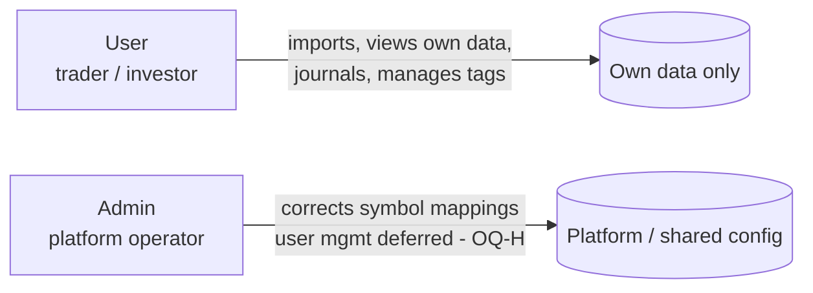
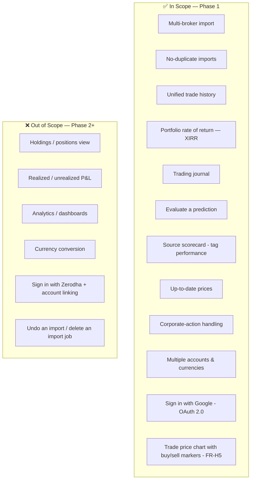
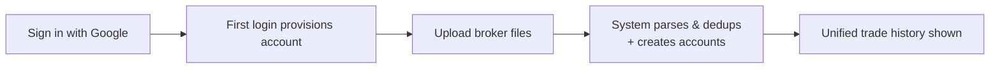
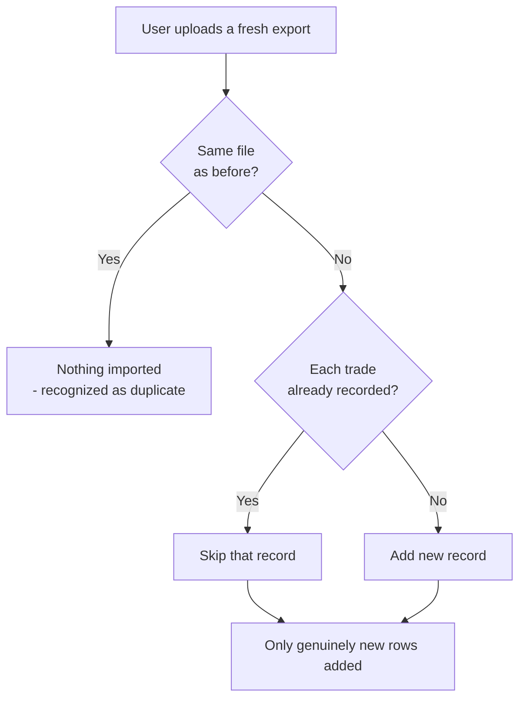
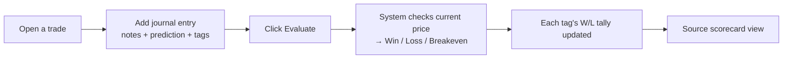

# Beyond Folio — Product Requirements Document (PRD)

> **Product:** Beyond Folio — a multi-broker investment portfolio management & trading journal.
> **Phase:** 1 (initial public release).
> **This document defines _what_ we are building and _why_.** The _how_ lives in the companion [`TRD.md`](./TRD.md); the plain-language feature source of truth is [`FEATURES.md`](./FEATURES.md).

---

## 1. Document Control

| Field             | Value                                                                                                                                                         |
| ----------------- | ------------------------------------------------------------------------------------------------------------------------------------------------------------- |
| Document          | Product Requirements Document (PRD)                                                                                                                           |
| Version           | 1.5                                                                                                                                                           |
| Status            | Draft — for review                                                                                                                                            |
| Owner             | Product                                                                                                                                                       |
| Reviewers         | Engineering, Design, QA                                                                                                                                       |
| Last updated      | 2026-09-07                                                                                                                                                    |
| Related documents | [`FEATURES.md`](./FEATURES.md) (feature source of truth), [`TRD.md`](./TRD.md) (technical), [`DYNAMODB_DATA_MODEL.md`](./DYNAMODB_DATA_MODEL.md) (data model) |

**Changelog**

| Version | Date       | Summary                                                                              |
| ------- | ---------- | ------------------------------------------------------------------------------------ |
| 1.0     | 2026-07-17 | Initial PRD for Phase 1.                                                             |
| 1.1     | 2026-07-25 | Auth pivot to self-managed OAuth 2.0 (Google P1, Zerodha P2); FR-A1…A6, OQ-F/OQ-G.   |
| 1.2     | 2026-07-27 | Added FR-H5 trade price chart with buy/sell markers; OQ-E.                            |
| 1.3     | 2026-09-06 | Import-mechanism decisions (D1–D14): FR-I2 single-account Fidelity (multi-account P2), FR-I4 confirmation-on-upload wording + canonical import statement, FR-H2/FR-M1 per-broker / broker-account language alignment. |
| 1.4     | 2026-09-07 | TRD-driven import-flow refinement: FR-I4 updated to the two-step (Proceed to Import → preview → Confirm) asynchronous flow with background processing + status notifications. |
| 1.5     | 2026-09-07 | Sync with TRD: OQ-F resolved (§5 hybrid JWT + refresh) and OQ-E largely resolved (§6 approach + 1M/6M/1Y range; provider TBD); FR-I2 clarified (single-account Fidelity accepted, multi-account rejected — not "consolidated"). |
| 1.6     | 2026-09-22 | Pre-implementation reconciliation: **OQ-E fully resolved** — providers chosen (INR → Zerodha Kite, USD → Twelve Data), routed by currency; price-cache key changed from `symbol+exchange` to `symbol+currency`; table count → 4 (added temporary Waitlist); FR-X1 "holdings" clarified (derived transient quantity vs. deferred positions view); admin-provisioning acceptance criterion added (manual DynamoDB role edit, no in-app promotion in Phase 1). |

---

## 2. Overview

Beyond Folio is an **investment portfolio management and trading journal** for retail investors who trade across more than one broker. Users upload the statement files their brokers already provide (Robinhood, Fidelity, Zerodha); Beyond Folio normalizes them into one consistent history, computes a true rate of return (XIRR), and lets users journal their trades — recording what they predicted, why, and whether it played out.

**The Phase-1 bet:** the highest-value, hardest-to-do-yourself job is _consolidation + honest performance measurement + a disciplined journal_. Phase 1 delivers exactly that — nothing more — so the first release is focused and trustworthy.

---

## 3. Problem & Opportunity

A modestly active investor typically holds accounts across several brokers — e.g. US stocks/options on **Robinhood**, an employer 401(k)/IRA on **Fidelity**, and Indian equities/derivatives on **Zerodha**. Each broker:

- exports its own CSV/XLSX format,
- uses its own terminology (`BUY` vs `YOU BOUGHT` vs `buy`),
- and has zero interoperability with the others.

**Result:** there is no single place to answer _"how is my whole portfolio actually doing?"_ Investors mentally stitch data silos together, and a true cross-broker rate of return is impossible without manual spreadsheet work.

**Opportunity:** be the unified import, storage, and analysis layer — plus a journal that turns scattered trades into a learning loop.

---

## 4. Goals, Non-Goals & Success Metrics

### 4.1 Goals (Phase 1)

| #   | Goal                                                                             |
| --- | -------------------------------------------------------------------------------- |
| G1  | Let a user import trade history from all three brokers into one unified view.    |
| G2  | Make re-uploading files completely safe — never create duplicates.               |
| G3  | Compute an honest, per-currency portfolio rate of return (XIRR).                 |
| G4  | Let users journal trades and measure which information sources actually perform. |
| G5  | Keep every user's data strictly private to them.                                 |

### 4.2 Non-Goals (explicitly out of Phase 1)

- Live holdings / portfolio-positions view
- Realized / unrealized profit & loss reporting *(incl. realized P/L on the trade chart's sell markers — Phase 2; see FR-H5)*
- Analytics dashboards / portfolio-wide summary charts *(the single per-trade price chart in FR-H5 is in scope; this excludes dashboard-style analytics)*
- Currency conversion or a single blended multi-currency return
- Placing trades, tax reporting, or investment advice

### 4.3 Success Metrics (KPIs)

| Metric                    | Target intent                                                            |
| ------------------------- | ------------------------------------------------------------------------ |
| Import success rate       | A supported broker file imports cleanly without manual fixes.            |
| Deduplication correctness | Re-uploading the same/overlapping files adds **zero** duplicate records. |
| XIRR availability         | Every user with cash flows sees a per-currency return figure.            |
| Journal engagement        | Users create journal entries and use the Evaluate action.                |
| Data isolation            | Zero cross-user data exposure incidents.                                 |

---

## 5. Personas & Roles

### 5.1 Primary persona — the active retail investor

- Holds 2–4 broker accounts across 1–2 countries.
- Trades equities, ETFs, options, mutual/money-market funds, and Indian F&O.
- Wants an honest **per-currency** performance figure (USD and INR shown separately in Phase 1) and a journal to learn from patterns.
- A **personal-finance power user** — not a casual investor, not institutional.

### 5.2 Roles & permissions

| Role      | Can do                                                                                           | Sees                            |
| --------- | ------------------------------------------------------------------------------------------------ | ------------------------------- |
| **User**  | Import files, browse own trade history, write journal entries, manage tags, evaluate predictions | **Only their own data**         |
| **Admin** | Add/correct corporate-action symbol mappings (user management — disable/delete — deferred; see OQ-H) | Platform / shared configuration |

> **Privacy is a hard rule:** one user's trades, journals, and account data are never visible to anyone else.

---

## 6. Scope (Phase 1)

**Supported brokers (Phase 1):**

| Broker    | Market        | Currency | Files per import                          |
| --------- | ------------- | -------- | ----------------------------------------- |
| Robinhood | United States | USD      | 1 CSV                                     |
| Fidelity  | United States | USD      | 1 CSV (all accounts combined)             |
| Zerodha   | India         | INR      | 2 files (equity, F&O) — CSV or XLSX       |

---

## 7. Functional Requirements

Requirements are grouped by capability. Priority uses **MoSCoW** (Must / Should / Could / Won't-in-Phase-1). Each requirement has acceptance criteria that define "done."

### 7.1 Authentication & Accounts

| ID    | Requirement                                                                                            | Priority        |
| ----- | ------------------------------------------------------------------------------------------------------ | --------------- |
| FR-A1 | A visitor can **sign in with Google** (OAuth 2.0). Beyond Folio stores **no passwords**.               | Must            |
| FR-A2 | On a user's **first** sign-in, an account is **provisioned automatically** (first-login provisioning). | Must            |
| FR-A3 | A user can **log in** and **log out** securely.                                                        | Must            |
| FR-A4 | Every account has a **role** (`user` or `admin`), managed by Beyond Folio.                             | Must            |
| FR-A5 | **Sign in with Zerodha** as an additional provider.                                                    | Won't (Phase 2) |
| FR-A6 | **Account linking** — associating a Google and a Zerodha login with the same Beyond Folio account.     | Won't (Phase 2) |

**Acceptance criteria (representative):**

- Only a user who completes Google sign-in gains access; identity and email are verified by Google.
- A first-time sign-in creates the account; a returning user resolves to the **same** account every time (via their stable Google identifier).
- Multi-factor authentication is handled by the identity provider (e.g. Google), not by Beyond Folio.
- A logged-in user only ever sees their own data (see FR-P1).

### 7.2 Import

| ID    | Requirement                                                                                                    | Priority |
| ----- | -------------------------------------------------------------------------------------------------------------- | -------- |
| FR-I1 | A user can upload a **Robinhood** activities CSV (equity + options).                                          | Must     |
| FR-I2 | A user can upload a **Fidelity** activity CSV (equity + options). Phase 1 supports a **single-account** Fidelity export (its rows all belong to that one Fidelity account). A **multi-account (combined) Fidelity file is not supported in Phase 1** — it is detected (by its account-identifying columns) and rejected with a message asking the user to upload an individual-account export; separating a combined multi-account file into distinct accounts is deferred to Phase 2. | Must     |
| FR-I3 | A user can upload the **Zerodha** set — an **equity** file and an **F&O** file — as separate uploads; each may be **CSV or XLSX**. | Must     |
| FR-I4 | The system parses each file into a clean, normalized trade & cash-activity history — **no manual entry of trade data**. The user's input is a **two-step confirmation**: they start the import (_Proceed to Import_), the system processes the file **in the background** and presents a **preview of what it understood** (the trades/cash activity to be added, plus any rows it will skip), and the user then **confirms** to write it. Because processing runs in the background, the user is notified when the preview is ready and when the import completes. | Must     |
| FR-I5 | Broker accounts are **created automatically** as they are discovered during import.                            | Must     |
| FR-I6 | The user sees an import result summary (records added / skipped).                                              | Should   |

**Acceptance criteria:**

- After a successful import, all trades/cash activity from the file appear in the unified history.
- A **single-account** Fidelity file imports under the user's one Fidelity account; a **multi-account (combined) Fidelity file is rejected** in Phase 1 with a message to upload an individual-account export (multi-account support is Phase 2).
- **What import stores (canonical):** every row in an uploaded file is imported and stored, except (i) rows recognized as duplicates and (ii) rows whose transaction type is intentionally unsupported (skipped). A buy/sell row is stored as **two** items — a Trade (for history) and a Cashflow (for XIRR); a deposit/withdrawal/dividend/interest/income/fee/royalty/adjustment row is stored as a Cashflow only; a non-cash position event is stored as a Trade only. Every Cashflow carries a flag stating whether it counts in XIRR (some rows — internal money-market sweeps, RSU-tax adjustments — are stored for the record but excluded). Imported/stored ≠ necessarily shown in the trade-history view.

### 7.3 Deduplication (Safe Re-Upload)

| ID    | Requirement                                                                         | Priority |
| ----- | ----------------------------------------------------------------------------------- | -------- |
| FR-D1 | Re-uploading the **exact same file** imports nothing new.                           | Must     |
| FR-D2 | Uploading a file that **overlaps** a previous one records each trade **only once**. | Must     |

**Acceptance criteria:**

- Uploading the same file twice results in identical data both times (idempotent).
- A fresh full-history export re-uploaded monthly adds only genuinely new records.

> **Known limitation (accepted):** two identical cash transfers of the _exact same amount on the same day_ in the same account may be recorded once. See §10.

### 7.4 Unified Trade History

| ID    | Requirement                                                                                       | Priority |
| ----- | ------------------------------------------------------------------------------------------------- | -------- |
| FR-H1 | All trades across all brokers/accounts appear in one combined, chronological view (newest first). | Must     |
| FR-H2 | The user can filter history to a **single broker**.                                               | Should   |
| FR-H3 | The user can filter history to a **single ticker**.                                               | Should   |
| FR-H4 | Opening a trade shows its detail (incl. options details and any journal entries).                 | Must     |
| FR-H5 | Opening an **equity** trade (stock/ETF) shows a **price chart** of that ticker with a **marker at each of the user's buy/sell transactions** on it (green circle = buy, red circle = sell); hovering a marker shows type, date, price, quantity. | Should   |

### 7.5 Portfolio Rate of Return (XIRR)

| ID    | Requirement                                                                                                                                                    | Priority |
| ----- | -------------------------------------------------------------------------------------------------------------------------------------------------------------- | -------- |
| FR-X1 | The system computes XIRR from all relevant cash flows (deposits, withdrawals, buys, sells, dividends, fees) **plus** the current value of holdings still held. | Must     |
| FR-X2 | XIRR is computed **per currency** (USD, INR) with **no conversion** or blending.                                                                               | Must     |
| FR-X3 | Current holdings are valued using up-to-date market prices.                                                                                                    | Must     |

**Acceptance criteria:**

- A user with USD and INR activity sees **two** separate return figures.
- The figure reflects the timing of every cash flow, not a simple average.
- **USD XIRR (Robinhood + Fidelity) includes fees/commissions** as cash flows. **INR XIRR (Zerodha) is computed *without* fees/charges in Phase 1** (Zerodha charges live only in a separate P&L report, which Phase 1 does not ingest), and the INR figure is shown with a **clear notice** that it excludes fees/charges/commissions. Capturing Zerodha charges is deferred to Phase 2 (see §10 OQ-I, §11).

### 7.6 Trading Journal

| ID    | Requirement                                                                                                         | Priority |
| ----- | ------------------------------------------------------------------------------------------------------------------- | -------- |
| FR-J1 | A user can attach a journal entry to a trade: free-text **notes** + a **prediction** (Bullish / Bearish / Neutral). | Must     |
| FR-J2 | A trade can have **multiple journal entries** (e.g. one per information source).                                    | Must     |
| FR-J3 | A journal entry can carry **multiple user-defined tags**.                                                           | Must     |
| FR-J4 | If a user has no trades yet, prompt them to import trades before journaling.                                        | Should   |

### 7.7 Evaluate a Prediction

| ID    | Requirement                                                                                                                               | Priority |
| ----- | ----------------------------------------------------------------------------------------------------------------------------------------- | -------- |
| FR-E1 | A user can click **Evaluate** on a journal entry; the system compares current price to the trade and marks it **Win / Loss / Breakeven**. | Must     |
| FR-E2 | Evaluation happens **on user demand** (the user controls when).                                                                           | Must     |

### 7.8 Source Scorecard (Tag Performance)

| ID    | Requirement                                                                                    | Priority |
| ----- | ---------------------------------------------------------------------------------------------- | -------- |
| FR-S1 | Each tag keeps a running **win / loss** tally, updated when an entry carrying it is evaluated. | Must     |
| FR-S2 | The user can view tags ranked by track record (e.g. `Money Control: 7W / 2L`).                 | Must     |

### 7.9 Prices

| ID     | Requirement                                                                                        | Priority |
| ------ | -------------------------------------------------------------------------------------------------- | -------- |
| FR-PR1 | The system fetches current market prices from external market-data services.                       | Must     |
| FR-PR2 | Prices are reused for a short time (cached) to keep the app responsive and avoid repeated lookups. | Must     |

### 7.10 Corporate-Action Handling

| ID    | Requirement                                                                                                                                         | Priority |
| ----- | --------------------------------------------------------------------------------------------------------------------------------------------------- | -------- |
| FR-C1 | When a ticker changes (merger, spin-off, rename, e.g. FB→META), old symbols are recognized as their current equivalent so history stays consistent. | Must     |
| FR-C2 | Symbol changes are detected automatically during import; an **admin** can add or correct mappings.                                                  | Must     |

### 7.11 Multiple Accounts & Currencies

| ID    | Requirement                                                                                          | Priority |
| ----- | ---------------------------------------------------------------------------------------------------- | -------- |
| FR-M1 | A user can hold accounts at **multiple brokers**, each kept distinct. _(Holding **multiple accounts within one broker** — e.g. Fidelity Individual + Roth + 401k — is deferred to Phase 2; in Phase 1 each broker has one account, fed by that broker's single-account file.)_ | Must     |
| FR-M2 | The system handles **USD and INR** side by side, each kept in its original currency.                 | Must     |

### 7.12 Privacy & Data Ownership

| ID    | Requirement                                                                             | Priority |
| ----- | --------------------------------------------------------------------------------------- | -------- |
| FR-P1 | A user can only ever access their own data.                                             | Must     |

---

## 8. Key User Journeys

### 8.1 Onboarding → first unified view

### 8.2 Periodic re-import (safe, no duplicates)

### 8.3 Journal → Evaluate → Scorecard

---

## 9. Assumptions, Constraints & Dependencies

| Type       | Item                                                                                      |
| ---------- | ----------------------------------------------------------------------------------------- |
| Constraint | Only three brokers in Phase 1: Robinhood, Fidelity, Zerodha.                              |
| Constraint | USD and INR are kept separate — **no currency conversion** in Phase 1.                    |
| Constraint | Personal-use / small-scale deployment (tens of users; ~500–2,000 trades/user/year).       |
| Assumption | Broker file formats remain stable; a format change requires a parser update.              |
| Assumption | Users obtain statement files from their brokers themselves (no direct broker API).        |
| Dependency | **Google OAuth 2.0 / OpenID Connect** as the identity provider for "Sign in with Google". |
| Dependency | External market-data services for current prices (US + India).                            |
| Dependency | External market-data service for **historical** price series (backing the FR-H5 trade chart), fetched lazily and reused for the day. |

---

## 10. Known Limitations & Open Questions

| ID   | Item                                                                                                                                  | Impact      | Status                                                                    |
| ---- | ------------------------------------------------------------------------------------------------------------------------------------- | ----------- | ------------------------------------------------------------------------- |
| OQ-A | Two identical same-day, same-amount cash transfers may be recorded only once — **narrowed by D2 to Robinhood only** (Fidelity's running `Cash Balance` and Zerodha's unique `trade_id` make those two brokers immune). | Low (rare)  | Accepted for Phase 1 (Robinhood-only residual)                           |
| OQ-B | Zerodha F&O files don't state whether a trade _opens_ or _closes_ a position — affects derived holdings for XIRR.                     | High        | Open; resolution planned                                                  |
| OQ-C | How each broker reports dividend reinvestment (DRIP) is unverified — affects return accuracy.                                         | Medium      | Open; verify against real files                                           |

| OQ-D | Whether the user profile is created at signup vs. first login.                                                                        | Low         | **Resolved** — created on first Google sign-in (first-login provisioning) |
| OQ-E | Historical price data for the FR-H5 trade chart — which external market-data service supplies the series, and the exact time range/granularity shown. | Low | **Resolved.** Approach (lazy fetch, 1-day reuse) and range (selectable 1M/6M/1Y, daily) locked in TRD §6; **providers now chosen — INR → Zerodha Kite API, USD → Twelve Data**, routed **by currency** behind one market-data interface (TRD §6.1). Cache keyed by `(canonicalSymbol, currency)` per data model §9.2; NSE/BSE same-INR collapse accepted (data model OQ-E2). |
| OQ-F | Session strategy after sign-in (how the user stays logged in — e.g. app-issued token vs. server session, refresh, logout/revocation). | Medium      | **Resolved in TRD §5** — hybrid: short-lived app-signed JWT access token + a stored, revocable refresh token (dedicated sessions table) |
| OQ-G | Account linking — treating a Google and a Zerodha login as one Beyond Folio account (Phase 2).                                        | Low         | Open; Phase 2                                                             |
| OQ-H | Admin user management (disable/delete a user) — stated as an admin capability but not modeled.                                        | Medium      | On hold; out of Phase 1 scope (would need a users-enumeration index + a second exception to per-user isolation) |
| OQ-I | Zerodha fees/charges (brokerage, STT, GST, stamp duty, etc.) are **not captured** in Phase 1 — they live only in Zerodha's separate P&L report, which is not ingested — so **INR XIRR excludes fees** and reads slightly optimistic. | Medium | Accepted for Phase 1; capturing Zerodha charges deferred to Phase 2 (mechanism TBD). USD XIRR **does** include fees. |
| OQ-J | Fidelity's per-row **commission** and **fees** columns. | Low | **Resolved (L7):** the Fidelity trade `Amount` is already **net** of commission+fees, so the net `Amount` is used as the cash leg and the commission/fees columns are kept as **display-only metadata** — never recorded as separate FEE cash flows (that would double-count them in the USD return). Residual (non-blocking): the exact per-column commission-vs-fees split is worth a spot-check against a broader real Fidelity export, but it does not affect the model. |

---

## 11. Release Plan

- **Phase 1 (this PRD):** the 12 in-scope capabilities in §6 — import, dedup, unified history, XIRR, journal, evaluate, scorecard, prices, corporate actions, multi-account/currency, authentication, and the per-trade price chart with buy/sell markers (FR-H5).
- **Phase 2+ (backlog):** holdings/positions view, realized/unrealized P&L, analytics dashboards, currency conversion, **undo an import** (delete an import job, removing all records it created), **Zerodha login + account-linking** (associating a Google and a Zerodha login with the same Beyond Folio account), **Zerodha fees/charges in INR XIRR** (ingesting the Zerodha P&L/charges report so INR XIRR includes fees — mechanism TBD; see §10 OQ-I), **realized P/L on the trade-chart sell markers** (a cost-basis method — e.g. average-cost or FIFO — plus profit/loss marker colouring and triangle markers, extending FR-H5), MFA, and other enhancements as prioritized.

---

## 12. Glossary

| Term                                  | Meaning                                                                                                                                                                |
| ------------------------------------- | ---------------------------------------------------------------------------------------------------------------------------------------------------------------------- |
| **XIRR**                              | Extended Internal Rate of Return — a true rate of return that accounts for the timing of every cash flow.                                                              |
| **Cash flow**                         | Any money movement: deposit, withdrawal, buy, sell, dividend, or fee.                                                                                                  |
| **Trade**                             | A buy or sell of a security (stock, ETF, option, fund, etc.).                                                                                                          |
| **Journal entry**                     | A user's note + prediction attached to a trade.                                                                                                                        |
| **Tag**                               | A user-defined label on a journal entry (e.g. an information source or strategy); carries a win/loss tally.                                                            |
| **Evaluate**                          | The action that marks a prediction Win / Loss / Breakeven using the current price.                                                                                     |
| **Corporate action**                  | An event that changes a ticker symbol (merger, spin-off, rename, etc.).                                                                                                |
| **Broker account**                    | One specific account at one broker; a user may have several **across brokers** (Phase 1: one account per broker — multiple accounts within the same broker is Phase 2).                                                           |
| **Admin**                             | Platform operator who corrects shared symbol mappings (broader user management — disable/delete — is deferred; see OQ-H).                                               |
| **OAuth 2.0 / OpenID Connect (OIDC)** | The industry-standard protocols behind "Sign in with Google" — the identity provider verifies the user and returns a signed proof of identity.                         |
| **Identity provider**                 | An external service (e.g. Google) that verifies who a user is and vouches for their identity, so Beyond Folio never has to handle passwords itself.                    |
| **`sub` (subject)**                   | The stable, unique identifier the identity provider assigns to a user; it stays the same across sign-ins, so a returning user is always recognized as the same person. |
| **First-login provisioning**          | Creating a user's account automatically the first time they successfully sign in (rather than a separate sign-up step).                                                |

---

_This PRD is implementation-agnostic. For architecture, data model, and engineering requirements, see [`TRD.md`](./TRD.md)._
ostic. For architecture, data model, and engineering requirements, see [`TRD.md`](./TRD.md)._
