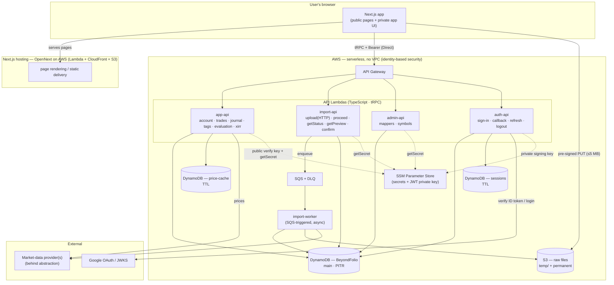

# Beyond Folio — Technical Requirements Document (TRD)

> **Product:** Beyond Folio — a multi-broker investment portfolio manager & trading journal.
> **Phase:** 1 (initial release).
> **This document defines _how_ we build Beyond Folio** — architecture, technology, and implementation. It sits on top of the completed [`PRD.md`](./PRD.md) (the _what_ and _why_), [`FEATURES.md`](./FEATURES.md) (plain-language features), and [`DYNAMODB_DATA_MODEL.md`](./DYNAMODB_DATA_MODEL.md) (the data model). Where those documents have already decided something, the TRD **builds on it and does not relitigate it.**

---

## 0. Document Control & Scope

| Field             | Value                                                                                                                                         |
| ----------------- | --------------------------------------------------------------------------------------------------------------------------------------------- |
| Document          | Technical Requirements Document (TRD)                                                                                                         |
| Version           | 1.0 (all sections authored — draft for review)                                                                                                |
| Status            | Draft — all sections authored; for review                                                                                                     |
| Owner             | Engineering                                                                                                                                   |
| Reviewers         | Product, Engineering, QA                                                                                                                      |
| Last updated      | 2026-09-07                                                                                                                                    |
| Related documents | [`PRD.md`](./PRD.md), [`FEATURES.md`](./FEATURES.md), [`DYNAMODB_DATA_MODEL.md`](./DYNAMODB_DATA_MODEL.md), [`memory-bank/`](../memory-bank/) |

**Changelog**

| Version | Date       | Summary                                                                                                                                                                                                                                                                                        |
| ------- | ---------- | ---------------------------------------------------------------------------------------------------------------------------------------------------------------------------------------------------------------------------------------------------------------------------------------------- |
| 0.1     | 2026-09-07 | Skeleton established; §2 Runtime & Import Execution authored (TRD Decision 1).                                                                                                                                                                                                                 |
| 0.2     | 2026-09-07 | §3 Technology Stack authored (TRD Decision 2): TypeScript backend; ElectroDB + SDK v3 data access; single Next.js frontend.                                                                                                                                                                    |
| 0.3     | 2026-09-07 | §4 API (tRPC; 3 API Lambdas + worker; procedure catalog; conventions) and §5 Authentication & Session (hybrid JWT + refresh; dedicated DynamoDB sessions table; openid-client + jose; tRPC auth middleware) authored (Decisions 3 & 4). Flags a 3rd DynamoDB table for ADR-003 reconciliation. |
| 0.4     | 2026-09-07 | §6 External Integrations authored (Decision 5): market-data provider abstraction (provider count deferred); OQ-E resolved (selectable 1M/6M/1Y daily, cache 1Y & slice); last-completed-session rule; graceful degradation.                                                                    |
| 0.5     | 2026-09-07 | §7 Storage & Infrastructure authored (Decision 6): 3 DynamoDB tables (PITR on main only); single S3 bucket + temp/ prefix lifecycle; SQS+DLQ; secrets in SSM Parameter Store via getSecret(); no VPC. Client→API topology locked as Direct (for §1).                                           |
| 0.6     | 2026-09-07 | §8 Deployment, Environments & CI/CD authored (Decision 7): AWS CDK (TypeScript); Next.js via OpenNext+CDK; local+CI+prod only; GitHub Actions + OIDC fully automated CD to prod; version-controlled BrokerMapper seed + manual first-admin bootstrap.                                          |
| 0.7     | 2026-09-07 | §9 Non-Functional Requirements authored (Decision 8): CloudWatch + X-Ray observability; pre-signed S3 upload w/ 5 MB cap; never-log PII policy; balanced required test tiers; no numeric SLAs (not real-time). Consolidates security/error/backup from §4–§8.                                  |
| 0.8     | 2026-09-07 | §10 Open Questions & Phase-2 Seams authored. Import-flow + sessions-table reconciliations applied back into source docs (data model, PRD v1.4, FEATURES); §2.6 marked reconciled.                                                                                                              |
| 0.9     | 2026-09-07 | Auth refinement: added a 4th `auth-api` Lambda (sole token issuer + sole sessions-table access) and **asymmetric JWT keys** (private key in auth-api, public verify key elsewhere) across §4.2/§4.3/§5.4/§5.6/§5.7/§7.4/§8.1/§9.1.                                                             |
| 1.0     | 2026-09-07 | §1 Architecture Overview authored (component diagram + request flows + trust boundaries). **All sections (§0–§10) now authored** — TRD structurally complete, draft for review.                                                                                                                |

### 0.1 Purpose

The PRD says _what_ Beyond Folio does and _why_; this TRD says _how_ it is built. Its job is to remove ambiguity for engineers: every meaningful technical choice is recorded as a decision with its context, the options weighed, and the reasoning — the same **ADR (Architecture Decision Record)** discipline already used in the data model.

### 0.2 What this document builds on and must not relitigate

The following are **locked** by the PRD / FEATURES / data model and are treated here as fixed inputs:

- **The data model** — the DynamoDB tables (the main `BeyondFolio` + price-cache; the TRD adds a third **sessions** table, §5.4), 3 GSIs, access patterns AP-1…AP-34, 16 ADRs, item shapes, the four `columnMapping` kinds, the data model §10.8/§10.9 import & normalization pipeline, per-broker deduplication (D2), the 10-value `cashflowType` (D4), and raw-file storage policy (ADR-016).
- **Authentication provider** — self-managed OAuth 2.0 (Google in Phase 1, Zerodha in Phase 2), app-managed `user`/`admin` roles (ADR-013).
- **Import-mechanism decisions D1–D14.**
- **Phase-1 scope boundaries** (PRD §6 / FEATURES §6) — no holdings/P&L, no analytics dashboards, no currency conversion, no undo-import, etc.

Where authoring the TRD surfaces a reason one of these should change, the change is **flagged for explicit approval** and reconciled back into the source docs — never silently overridden.

### 0.3 Decisions the PRD explicitly defers to this TRD

- **OQ-F — Session / token strategy.** The provider is decided (OAuth 2.0); the _session mechanism_ (how a signed-in session is carried and ended) is settled here. See §5.
- **OQ-E — Historical market-data provider/range.** The pattern is settled (lazy fetch + 1-day-fresh `PRICEHIST#` cache, ADR-014); the external provider and exact range/granularity are settled here. See §6.

### 0.4 How to read this document

Written for a **dual audience** — plain-terms explanation first (so any reader can follow), with precise engineering detail alongside. Each section carries a **status marker**: 🟢 Authored · 🟡 In progress · 🔴 Not started.

**Cross-reference conventions:**

- **`ADR-NNN`** refers to an **Architecture Decision Record in the data model** (`DYNAMODB_DATA_MODEL.md` §5) — e.g. ADR-002 (per-user key rooting), ADR-013 (self-managed OAuth), ADR-016 (raw-file storage). These are the data model's decisions that this TRD builds on; they are **not** re-decided here.
- **A bare `§N`** (e.g. §5, §7.4) means **this TRD's** section N. A cross-reference **into the data model** is written as **"data model §N"** (e.g. "data model §10.8", "data model §9.6") to avoid confusion, since both documents have their own section numbering. `AP-N` = an access pattern from the data model's §4 catalog; `Dn` / `Ln` = the locked import decisions recorded in the memory bank / data model.

---

## 1. Architecture Overview 🟢 Authored

> Scope: the system's components and how they connect, the key request flows, and the trust boundaries between them. This section is a **synthesis** of the decisions detailed in §2–§10 — it introduces nothing new; where a component or choice is summarized here, its full rationale lives in the referenced section.

### 1.1 System context

Beyond Folio is an AWS-native serverless application: a single Next.js app (public + private pages) talks **directly** to a tRPC API on AWS Lambda, backed by four DynamoDB tables (main, price-cache, sessions, and a temporary waitlist), an S3 bucket for raw import files, and two external dependencies (Google OAuth and market-data providers). The diagram shows every component and how they connect.



> **Reading the diagram.** `app-api` reaching **Main + price-cache** covers the everyday reads plus XIRR/Evaluate valuation; **`auth-api` is the sole holder of the sessions table and the JWT private signing key** (the other Lambdas verify tokens with only the public key). The **Direct topology** is visible: the browser talks to API Gateway (tRPC + Bearer) and uploads straight to S3 (pre-signed PUT) — the Next.js hosting only _serves pages_ and is never in the API path. The `import-worker` is reached only via SQS and touches Main + S3 (and market data during normalization); it holds no session or secret access.

| Component                                               | Responsibility                                                                        | Defined in |
| ------------------------------------------------------- | ------------------------------------------------------------------------------------- | ---------- |
| **Next.js app**                                         | Single frontend — public (SEO/SSR) + private authenticated UI; calls the API directly | §3.3, §8.2 |
| **API Gateway**                                         | Entry point for all tRPC + HTTP API calls                                             | §4         |
| **`app-api` / `import-api` / `admin-api` / `auth-api`** | The four domain-grouped API Lambdas (TypeScript, tRPC)                                | §4.2       |
| **`import-worker`**                                     | Async SQS-triggered parse → normalize → write                                         | §2, §4.2   |
| **SQS + DLQ**                                           | Durable import job queue + poison-message capture                                     | §2.2, §7.3 |
| **DynamoDB ×3**                                         | `BeyondFolio` (main, PITR), price-cache (TTL), sessions (TTL)                         | §7.1       |
| **S3**                                                  | Raw import files — `temp/` staging + permanent keep-forever                           | §7.2       |
| **SSM Parameter Store**                                 | Secrets + JWT private key (least-privilege per Lambda)                                | §7.4       |
| **Google OAuth / JWKS**                                 | Identity provider (sign-in)                                                           | §5         |
| **Market-data provider(s)**                             | Current + historical prices, behind an abstraction                                    | §6         |

### 1.2 Key request flows

**Sign-in (§5).** Browser → `auth-api` starts the OAuth 2.0 / OIDC authorization-code flow (with PKCE, `state`/`nonce`) → Google → callback to `auth-api` → verify the ID token against Google's JWKS → read `sub`, resolve to internal `userId` via the AuthIdentity item (first sign-in provisions the User + AuthIdentity) → `auth-api` signs a short-lived JWT **access token** (private key) and writes a **refresh token** to the sessions table → the access token is returned to the browser (held in memory) and the refresh token is set as an `HttpOnly` + `Secure` + `SameSite=Lax` cookie.

**Import — the two-gate asynchronous flow (§2.3).** The most involved flow; shown end-to-end:

```mermaid
sequenceDiagram
    actor U as Browser
    participant IA as import-api
    participant S3 as S3
    participant Q as SQS
    participant W as import-worker
    participant DB as DynamoDB (main)

    U->>IA: request upload URL
    IA-->>U: pre-signed URL (temp/, ≤5MB)
    U->>S3: PUT raw file (temp/)
    U->>IA: proceed(importId)   [Gate 1]
    IA->>DB: ImportedFile UPLOADED → PROCESSING
    IA->>Q: enqueue process job
    Q->>W: deliver job
    W->>S3: read raw file
    W->>DB: minimal parse + Layer-2 dedup + normalize new rows; park batch; status = PREVIEW_READY
    loop while processing / awaiting confirm
        U->>IA: getStatus / getPreview
        IA-->>U: counts + normalized rows + skipped/unsupported
    end
    U->>IA: confirm(importId)   [Gate 2]
    IA->>Q: enqueue commit job
    Q->>W: deliver job
    W->>S3: promote temp → permanent (<userId>/<contentHash>)
    W->>DB: write Trades/Cashflows (attribute_not_exists); status = COMPLETE
    U->>IA: getStatus → COMPLETE
```

**Read — trade history / XIRR (§4, §6).** Browser sends a tRPC call with the Bearer access token → `app-api` verifies the token signature (public key) → the verified `userId` scopes the query → read from the main table. For XIRR, `app-api` reads the per-currency cashflow timeline and values open positions using the price-cache (fetching from a provider on a miss).

**Evaluate a prediction (§4, §6).** tRPC → `app-api` fetches the current price (price-cache → provider on miss) → computes Win/Loss/Breakeven → atomically updates the tag scorecard counters → returns the outcome with the price it used embedded in the response.

### 1.3 Trust & security boundaries

- **The browser is untrusted.** All access is mediated by API Gateway and the tRPC **verify-middleware**, which derives the `userId` from the **verified token — never from client input** (§5.7). Per-user data isolation is then structural via `USER#<userId>` key rooting (ADR-002).
- **`auth-api` is the security keystone.** It is the **only** Lambda that can mint tokens (holds the JWT private signing key) and the **only** one with access to the sessions table; every other Lambda can merely _verify_ tokens with the public key (§4.2, §5.4, §5.6).
- **Least-privilege IAM per Lambda** (§7.4): each function reaches only the stores/secrets it needs.
- **Backend-only data stores.** The browser reaches only two things directly — the API (tRPC + Bearer) and pre-signed S3 PUTs into `temp/`; it never touches DynamoDB or the permanent S3 keys.
- **TLS everywhere; no VPC** — security is identity-based (IAM + TLS), not network-placement-based (§7.5).

### 1.4 Cross-cutting principles

A few principles recur across the design (each detailed in its section):

- **Per-user key rooting** — privacy is a property of the data layout, not app-layer filtering (ADR-002).
- **Invocation-agnostic business logic** — logic lives in shared modules; API handlers and the SQS worker are thin entry points, keeping runtime/trigger choices swappable (§2.5).
- **Cache-fronted external calls** — market data is served from the price caches first, hitting providers only on a miss (§6).
- **Idempotent writes as the retry-safety foundation** — deterministic keys + `attribute_not_exists` make any retry safe; the queue merely supplies the retry (§2.4).

> This overview synthesizes the decisions detailed in §2–§10; consult those sections for the reasoning, alternatives weighed, and implementation specifics behind each component summarized here.

---

## 2. Runtime & Import Execution 🟢 Authored

> Scope: where our code runs (the compute/runtime shape) and how the file-import workload executes on it (synchronous vs. asynchronous, and the concrete import pipeline). This is the keystone decision — it constrains the technology stack, the session mechanism, and the deployment tooling that follow.

### 2.1 Runtime shape — serverless (AWS Lambda + API Gateway)

**In plain terms.** Every user request has to be received and handled by _something_. There were two families of answer: an **always-on server** that runs 24/7 waiting for requests, or **on-demand functions** ("serverless") that spin up when a request arrives, handle it, and disappear. Beyond Folio uses the **serverless** model — AWS Lambda functions behind an API Gateway.

**Decision.** Run the backend as **serverless functions (AWS Lambda) behind API Gateway.**

**Why.**

- **The load profile fits it exactly.** Phase-1 usage is small, bursty, and idle most of the day (tens of users; imports "possible but rare" per the scale envelope). Serverless _scales to zero_ — an idle app costs almost nothing — which is the opposite of an always-on server that bills around the clock whether used or not.
- **It matches what we've already committed to.** The data layer (DynamoDB **on-demand**) and file storage (**S3**) are both pay-per-use, AWS-native, serverless-style services. A serverless compute tier completes that picture consistently.
- **Latency needs are relaxed.** Beyond Folio is not a real-time trading system; the brief "cold start" delay a serverless function can incur on the first request after idle is a non-issue here.

**Alternatives considered.**

- **Always-on container/server (e.g. ECS/Fargate, App Runner).** Simplest mental model (a plain web server) and it removes per-request time limits — attractive, but it pays for capacity 24/7 to run an app that is idle most of the time, and it pulls against the serverless grain of the rest of the stack. Rejected for Phase 1 on cost-fit and consistency grounds.
- **Hybrid (functions for the API, a separate always-on worker).** More moving parts than the scale justifies. Rejected as premature.

**Reversibility (important).** Choosing serverless now does **not** lock us in. A future move to an always-on server is a **contained change (~4/10 on effort)**, _provided_ one discipline is honored from day one: keep the **business logic invocation-agnostic** — plain functions that take inputs and return outputs, that do not reach into the HTTP request/response object or assume "I must finish within this response." The API handler and any worker are then thin wrappers around that logic, and switching runtimes rewrites only those wrappers, not the valuable core. Starting serverless also keeps the _cheaper_ migration direction ahead of us (consolidating stateless functions into one server is easier than the reverse). This is adopted as a standing TRD principle (see §2.5).

**Consequence for sessions.** A serverless function keeps **no memory between requests** — each invocation may be a fresh worker that has never seen the user. So "staying signed in" cannot live in server memory; it must be carried in the request (a signed token) or read from a shared store. This directly shapes the session decision (OQ-F, §5) and is noted there.

### 2.2 Import execution — asynchronous background job (SQS + dead-letter queue)

**In plain terms.** When a user imports a broker file, the heavy work (parsing, de-duplicating, normalizing, and writing hundreds-to-thousands of rows) can take several seconds. The question is whether the user's request _waits_ for all of it (**synchronous**) or whether the request returns immediately and the work runs **in the background** (**asynchronous**). Beyond Folio runs the heavy import work **asynchronously**, driven by a message queue (**Amazon SQS**) with a **dead-letter queue (DLQ)** for failures.

**Decision.** The heavy phases of an import run as **asynchronous background jobs**, triggered via **SQS**, processed by a worker Lambda, with a **DLQ** for terminal failures.

**Why not synchronous.** Designing for the worst case (a large import — on the order of ~5,000 rows — treated as a routine, not rare, event), a synchronous import runs 10–18 seconds against the practical **~29-second API Gateway limit**. That is uncomfortably close to the ceiling; ordinary variance (a throttled-write retry, a cold start, a heavier row mix) can push it over, turning imports into intermittent timeouts. Worse, in the synchronous model the import rides the **user's own connection** — if their network drops or they close the tab mid-import, the request visibly fails. Asynchronous execution removes both problems: the request returns in milliseconds and the work runs independently of the user's connection.

**Why SQS specifically (and not the lighter alternatives).**

- **Fire-and-forget async invoke** (one function directly triggers another) is the lightest, but it has **weak retry guarantees** — a hard crash can leave a job silently unfinished, forcing a manual "resume." This re-introduces the very unreliability we chose async to avoid.
- **DynamoDB Streams as the trigger** (letting the "job created" write also start the job) is elegant, but analysis showed it does **not** actually avoid a queue: the retry-until-success behavior is a property of the **Lambda event source mapping**, not Streams itself, and production-safe use requires an **`OnFailure` destination** — in practice a queue — for terminal failures. It also **re-fires on the status-update write** unless explicitly filtered, and its **per-shard ordering** means one "poison" record can block others in the same shard, with cross-user isolation depending on an unverified partition-key→shard mapping. Since a queue is required either way, an explicit queue **as the primary trigger** is the more honest and conventional design.

So the choice converges on **SQS + DLQ** as the primary trigger: explicit, conventional, with well-documented retry and dead-letter semantics.

### 2.3 The import pipeline (two-gate, async-normalize)

**In plain terms.** An import has two heavy phases separated by a **human decision**: first we read and interpret the file (so we can show the user exactly what we understood), then — only after the user confirms — we write it to the database. The user therefore clicks **twice**: once to _start_ processing, and once to _confirm_ the interpreted result before anything is saved. This gives the user a genuine checkpoint on the normalized rows before they touch durable storage.

The full flow:

```
1. User clicks Upload → uploads the CSV/XLSX file.
2. Layer-1 file-hash dedup (SHA-256 over the raw bytes).
     • duplicate file  → STOP, show "already imported."
3. Detect broker + file type by header fingerprint (AP-33).
     • no mapper match → HARD STOP ("this file doesn't match our formats — contact support").
     • match           → show "detected <broker>", "uploaded successfully", + [Proceed to Import].
4. Raw file written to a TEMP location in S3 (parked; lifecycle-expired if abandoned).

── GATE 1 — user clicks [Proceed to Import] ──

5. ASYNC job (SQS → worker; the user may switch tabs / lose connection):
     • find-or-create the BrokerAccount by (userId, broker).
     • minimal parse + Layer-2 dedup → classify each row: new / duplicate / unsupported.
     • FULL normalization of the new + supported rows only.
     • PARK the normalized batch in S3 (one object keyed to the import).
     • set ImportedFile.status = PREVIEW_READY.
6. In-app notification: "your file is processed — ready for your confirmation."

── user opens the job → PREVIEW: counts + the normalized imported rows + the skipped/unsupported rows ──

── GATE 2 — user clicks [Confirm] ──

7. ASYNC write job (SQS → worker), reading the parked normalized batch:
     (a) promote the raw file from TEMP → permanent S3 key <userId>/<contentHash>  (ADR-016).
     (b) write/update the ImportedFile record with its s3Key.
     (c) write the Trades/Cashflows, each guarded by attribute_not_exists (Layer-2 re-enforced).
     • delete the parked normalized batch and the temp raw file.
     • set ImportedFile.status = COMPLETE.
```

**Why this order.** The cheap work (upload, file-hash dedup, broker detection) runs **synchronously** before Gate 1 — it is fast and the user is actively waiting. The expensive work (full normalization; the many database writes) runs **asynchronously**, split around the confirm gate. This keeps the request path fast, decouples the heavy work from the user's connection, and preserves the locked optimization of **fully normalizing only genuinely-new rows** (Layer-2 runs before normalization).

**The preview shows the interpreted result, not a raw sample.** Rather than a sample of raw input rows (which only shows the user what they already gave us), the preview shows (a) the **counts** — imported / duplicate-skipped / unsupported-skipped — and (b) the **normalized imported rows** (exactly what Beyond Folio understood) plus (c) the **skipped/unsupported rows** (so the user sees precisely what will _not_ be imported). This is the information the user actually needs to make the confirm decision.

### 2.4 Reliability model — idempotent dedup is the load-bearing piece

**The order of dependence matters.** The safety of retrying an import comes **first** from the data model's **idempotent, deterministic writes** (ADR-005: deterministic `tradeId`/`cashflowId` + `attribute_not_exists`), and only _then_ from the queue. Restated: **idempotent writes make any retry safe; the queue merely supplies the retry.** A retry mechanism on top of non-idempotent writes would simply corrupt data more efficiently — so the dedup is the foundation, and SQS is the transport.

Given that foundation:

- **Transient failure / crash mid-job:** SQS redelivers the message after the visibility timeout; the worker re-runs, the already-written rows are skipped by `attribute_not_exists`, and the job completes. Self-healing, no user action.
- **Poison job (fails every time):** a bounded `maxReceiveCount` sends the message to the **DLQ** after N attempts; the worker marks `ImportedFile.status = FAILED`. No invisible stuck jobs; the bad message is captured for inspection without blocking others.
- **Parking cleanup:** the temp raw file and the parked normalized batch are lifecycle-expired if an import is abandoned, and deleted on successful completion — so orphaned artifacts cannot accumulate.

### 2.5 The `ImportedFile` status spine, and the invocation-agnostic principle

**Status spine.** A single `ImportedFile` record tracks an import across all phases via a `status` field:

```
UPLOADED → PROCESSING → PREVIEW_READY → COMMITTING → COMPLETE
                                   ↘ FAILED   ↘ CANCELLED
```

The UI **polls** this record to drive its display and the "ready for confirmation" notification. The record is **created once at upload** (its creation _is_ the Layer-1 `attribute_not_exists` dedup gate) and **updated** through its lifecycle — the confirm-time write becomes an _update_ that attaches the `s3Key`, not a second create.

**Invocation-agnostic import pipeline (standing principle).** The import logic is written as a **standalone, invocation-agnostic function** — plain inputs → work → update `ImportedFile` status — with the API handler and the SQS worker as **thin wrappers**. This keeps the trigger mechanism swappable (SQS today, something else later) and preserves the cheap serverless→server migration path from §2.1.

### 2.6 Impact on locked source docs (✅ reconciled 2026-09-07)

This decision refined several **locked** import decisions; the following changes have now been **reconciled back into the source docs** (data model, PRD, FEATURES, and the memory-bank lock records) — they were flagged and applied deliberately, not silently overridden:

- **L5 / data-model §10.8:** the preview drops the "read-only ~20-row raw sample" in favor of **counts + normalized imported rows + skipped/unsupported rows**. ✅
- **L4 / data model §10.8 order:** full normalization moves to **after Gate 1 (async)**; the write moves to **after Gate 2**; the single confirmation becomes **two gates** (Proceed to Import + Confirm). The underlying rationale (cheap-checks-first, normalize-new-only) is unchanged. ✅
- **D13:** one manual confirmation → **two gates**. ✅ (PRD FR-I4, FEATURES §5.1)
- **ADR-016 / data model §7.3:** **temp-upload → promote-on-confirm** (a permanent copy still exists only for confirmed imports; abandoned/cancelled files are never promoted); the **normalized batch is parked** in temp S3 alongside the raw file; upload is **pre-signed direct-to-S3**. ✅
- **data model §10.8 / §7.3:** the `ImportedFile` write is **create-once-at-upload + update-through-lifecycle** (a `status` attribute was added). ✅
- **PRD / FEATURES:** the **import-status UX** (async: "processing → ready for confirmation → complete") is reflected in PRD FR-I4 (v1.4) and FEATURES §5.1. ✅

---

## 3. Technology Stack 🟢 Authored

> Scope: the backend language, the DynamoDB data-access layer, and the frontend framework — the languages and libraries we build in, chosen to fit the serverless runtime locked in §2. Each sub-decision is presented as options-with-tradeoffs, then a decision.

**Summary of the stack.**

| Layer                           | Choice                                                        |
| ------------------------------- | ------------------------------------------------------------- |
| Backend language                | **TypeScript** (Node.js on AWS Lambda)                        |
| Data-access — main table        | **ElectroDB** (single-table toolkit) over AWS SDK v3          |
| Data-access — price-cache table | **Raw AWS SDK v3** (DocumentClient)                           |
| Frontend                        | **A single Next.js app** (public + private pages), TypeScript |

### 3.1 Backend language — TypeScript (Node.js on Lambda)

**In plain terms.** The backend needs one primary programming language. The frontend is already fixed as **TypeScript**, and the backend is **TypeScript** too — so the whole product is one language end to end.

**Decision.** Write the backend in **TypeScript**, running on Node.js Lambda functions.

**Why.**

- **Stack unification.** With the frontend already TypeScript, an all-TypeScript backend means **one language, one toolchain, and shared types**: the API's request/response shapes can be the _same_ types the frontend consumes, so client and server can't silently drift apart.
- **Best-in-class DynamoDB tooling.** The strongest single-table DynamoDB libraries (see §3.2) are TypeScript-native and map directly onto our data model's overloaded-key + GSI + `entityType` design.
- **Types across the import pipeline.** Modeling the four `columnMapping` kinds, the 10-value `cashflowType` (D4), and the Trade/Cashflow shapes as types turns a class of normalization bugs into compile-time errors.
- **Runtime fit.** Node cold starts are on the favorable side, the modular AWS SDK v3 keeps deployment packages small, and async I/O suits the many-parallel-DynamoDB-writes + external market-data calls of our workload. Mature libraries exist for OAuth/JWKS (`jose`, `openid-client`), CSV (`csv-parse`), and XLSX (`exceljs`/SheetJS).

**Alternatives considered.**

- **Python.** Superb for data wrangling (pandas) and numerical work (numpy/scipy, or the dedicated `pyxirr`), which are genuinely relevant to parsing and XIRR. Rejected as the _primary_ language because: it shares no language with the TS frontend (no shared types), its single-table DynamoDB tooling is weaker, and its data libraries make cold starts heavier — precisely because the libraries that make Python attractive (pandas/numpy) are large, partly-native packages.
- **Go.** Fastest cold starts and lowest memory, but slower to develop, a thinner ecosystem for XLSX and single-table DynamoDB, and no frontend language sharing — overkill for a tens-of-users app where developer velocity matters more than runtime speed.

**Deferred Python escape-hatch (held, not adopted).** Serverless makes each Lambda an independently deployable unit, so a _single_ feature could be written in Python without making the whole backend polyglot. If — and only if — a specific feature proves genuinely hard to do well in TypeScript (realistically **XIRR**, via `pyxirr`, or **heavy CSV/XLSX parsing/normalization**, via pandas), that one feature may be isolated in a dedicated Python Lambda with a small, schema-validated input/output contract. This is an explicitly-held option to revisit **only if** the TypeScript implementation is inadequate; we do **not** pay the polyglot cost up front, because:

- **Two toolchains, forever** — two package managers, lint/format/test setups, runtime-upgrade cadences, and CI paths, maintained in parallel.
- **The type boundary breaks at the seam** — a TS→Python handoff (e.g. an SQS message) loses compile-time type safety; the contract must be defined and validated by hand on both sides.
- **Domain models must be defined twice** — e.g. the 10-value `cashflowType` would live in both a TypeScript type and a Python definition, kept in sync by discipline rather than the compiler.
- **The wins are narrow and reproducible in TS** — XIRR is a compact root-finding routine (~50 lines or a small npm package), and CSV/XLSX parsing in TS is fully capable; pandas is _nicer_, not _necessary_, at our volumes.

### 3.2 Data-access layer — ElectroDB (main table) + AWS SDK v3 (price-cache table)

**In plain terms.** Our data lives in DynamoDB, where each item is addressed by a `PK`/`SK` key built from string prefixes (e.g. `TRADE#2026-01-15#t_abc`). Code either **builds and parses those key strings by hand** (raw AWS SDK) or uses a **single-table library** that lets you describe each entity once and builds/parses the keys for you.

**Decision.** Use **ElectroDB** — a TypeScript single-table toolkit — for the main `BeyondFolio` table, and the **raw AWS SDK v3 DocumentClient** for the auxiliary price-cache table.

**Why this split.**

- **The main table is a complex single-table design** — around eleven overloaded entity types (User, BrokerAccount, Trade, Cashflow, ImportedFile, JournalEntry, Tag, Journal↔Tag link, TagScorecard, SymbolMapping, BrokerMapper, AuthIdentity), three GSIs, time-ordered sort keys, and `entityType` self-identification. Hand-building every key string here is repetitive and error-prone: a single typo in a prefix (`TRADE#` vs `TRADES#`) silently breaks a query with no compiler help. ElectroDB lets each entity be described once (its keys, attributes, and GSIs) and then constructs the correct keys and GSI queries for us — turning our access patterns (AP-1…AP-34) into named, typed queries. It is purpose-built for exactly this overloaded-key + GSI + `entityType` style, and it is TypeScript-native (reinforcing §3.1).
- **The price-cache table is trivial** — two simple key-value item types (`PRICE#<canonicalSymbol>#<currency>` and `PRICEHIST#<canonicalSymbol>#<currency>`), no sort key, no GSI, TTL-driven. A modeling library would be overkill here; direct DocumentClient `GetItem`/`PutItem` calls are clearer and dependency-free.

This "**library where it earns its place, raw SDK where it doesn't**" split mirrors the data model's own ADR-003 spirit (consolidate by default, separate with purpose).

**Alternatives considered.**

- **Raw AWS SDK v3 everywhere (no ElectroDB).** Zero third-party data dependency and full control — a defensible minimalist choice — but it pushes all the key-construction/parsing and GSI-routing for the _complex_ main table into hand-written code, which is the error surface ElectroDB removes. Rejected for the main table on maintainability grounds; adopted for the simple price-cache table.
- **Other toolkits (OneTable, Dynamoose).** OneTable is a close alternative; Dynamoose is more ORM-like and less single-table-idiomatic. ElectroDB was chosen as the most single-table-focused and widely used of the TS options; this is not a load-bearing choice and could be revisited without affecting the data model.

> **Note.** ElectroDB is a data-access convenience, not a schema authority — the authoritative data model remains `DYNAMODB_DATA_MODEL.md`. ElectroDB entity definitions must _encode_ that model, never redefine it.

### 3.3 Frontend — a single Next.js app (public + private)

**In plain terms.** The frontend is a **single Next.js application** that serves both the **public** pages (a logged-out visitor — and a search engine — can see them; e.g. a landing/marketing page) and the **private** pages (everything behind Google sign-in: trade history, XIRR, journal, scorecards, import). Both live in one TypeScript codebase.

**Decision.** Build the frontend as **one Next.js app** covering public and private pages.

**Why.**

- **Public pages are in the plan from the start**, and public pages need **SEO** — search engines must be able to read the page's content. A plain browser-rendered single-page app (SPA) serves a near-empty initial page to crawlers and indexes poorly; **Next.js renders real HTML on the server** (SSR/SSG), which indexes and link-previews well. SEO is **hard to retrofit** onto an SPA later, so choosing an SEO-capable framework up front avoids a painful migration.
- **Next.js is a superset of what an SPA does.** It serves the private, authenticated app pages just as well as an SPA _and_ handles the public/SEO pages an SPA cannot — in one framework, one toolchain, one shared design system, and shared types with the backend.
- **Still 100% TypeScript**, honoring §3.1 and preserving shared types with the backend API.

**Alternatives considered.**

- **React + Vite SPA (static files on S3 + CloudFront).** Simplest and cheapest to host (pure static assets, no rendering server) and perfectly good for _private_ pages — but it renders in the browser, so it is **poor for the public/SEO pages** we plan from the start. Rejected because its one advantage (hosting simplicity) is minor at our scale, while its weakness (SEO) is exactly what our roadmap needs.
- **Two-app split (React+Vite SPA for the app + a separate Next.js site for public pages, linked by a login redirect).** Feasible and a real pattern, but it re-creates _two_ apps to do what one Next.js app does: it duplicates the shared UI/design system (or forces a third shared-component package), runs **two toolchains and two deployments**, and makes the public→app transition a hard cross-origin redirect. Rejected because it pays ongoing duplication costs to achieve the same outcome a single Next.js app gives with less effort — and because, once Next.js serves the private pages equally well, there is no remaining reason to also run a separate SPA.

**Honest caveat (hosting).** Unlike a pure static SPA, Next.js needs a **rendering host** — e.g. **AWS Amplify Hosting** or Next-on-Lambda — which is marginally more infrastructure than serving static files from S3. At our scale (tens of users) this is a minor operational and cost detail, not a burden. The concrete hosting choice is settled in §8 (Deployment).

**Cross-reference.** This TypeScript/Next.js frontend interacts with the API-style decision in §4: a fully type-safe client↔server option (tRPC) pairs naturally with this stack. That tradeoff is weighed when §4 is authored.

---

## 4. API Design & Contracts 🟢 Authored

> Scope: the API style, how it is packaged onto Lambda, the concrete operation surface mapped to the FR-* requirements and AP-1…AP-34, and the cross-cutting conventions (pagination, errors, validation, import-status). Authentication enforcement is a shared concern with §5 and is defined there (§5.6), referenced from here.

### 4.1 API style — tRPC (with a plain HTTP endpoint for file upload)

**In plain terms.** The frontend and backend talk over **tRPC**: the Next.js app calls backend operations as if they were local, strongly-typed functions, with the types flowing automatically from server to client. The one exception is **file upload**, which uses a plain HTTP endpoint (binary/multipart data doesn't fit tRPC's JSON model).

**Decision.** Use **tRPC** for all data operations; use a **plain HTTP endpoint** for the CSV/XLSX file upload (and any health-check/operational endpoints).

**Why.**

- **It fits our exact situation.** The API is consumed by exactly one first-party client (our own Next.js app), both ends are TypeScript, and the operation set is bounded (AP-1…AP-34). tRPC gives **end-to-end type safety with no schema file and no code generation** — rename a backend procedure and the frontend fails to compile until it's fixed.
- **Command-style actions are natural.** Several operations are actions, not resources — `import.confirm`, `import.proceed`, `evaluation.evaluate`. In tRPC these are just typed function calls; there is no need to force them into REST's noun/verb URL model.
- **Its main limitation does not apply to us.** tRPC is TypeScript-only and tightly couples client to server, which would be a poor fit for a **public, third-party API**. We have decided the API will **never** be opened to third parties, so this limitation is inert.
- **Security is neutral-to-favorable.** The attacks that matter most — cross-user data access and CSRF — are handled by the auth layer (§5), not the API style. tRPC validates every input with **Zod** by default (see §4.4), which is a small input-hygiene benefit.

**Alternatives considered.**

- **REST.** Universally understood, portable, and the right choice _if_ a public/third-party or non-TypeScript API were ever needed — but that need is explicitly excluded, so REST's headline advantages (portability, external-consumer readiness, natural CDN caching of public responses) are unused for our private, per-user data. Its cost for us (manual client/server type-safety upkeep, awkward modeling of command actions) is real. Rejected on fit.
- **GraphQL.** Valuable when many diverse clients need flexible field selection; overkill for a single, known client with a bounded operation set. Rejected as unnecessary complexity.

### 4.2 Deployment shape — four domain-grouped API Lambdas + one async worker

**In plain terms.** The API's operations are split across **four Lambda functions grouped by domain**, plus the separate background import worker from §2. This isolates the three areas worth isolating — the heavy, spiky **import** path, the privileged **admin** path, and the security-critical **auth** path — while keeping the many similar everyday operations together.

**Decision.**

| Lambda              | Trigger     | Contains                                                                                                                                                          |
| ------------------- | ----------- | ----------------------------------------------------------------------------------------------------------------------------------------------------------------- |
| **`app-api`**       | API Gateway | Everyday user operations: `account`, `trades`, `journal`, `tags`, `evaluation`, `xirr` (+ internal symbol/price use)                                              |
| **`import-api`**    | API Gateway | Import's _synchronous_ calls: file upload (HTTP), `proceed`, `getStatus`, `getPreview`, `confirm`                                                                 |
| **`admin-api`**     | API Gateway | Admin-only: BrokerMapper + SymbolMapping management                                                                                                               |
| **`auth-api`**      | API Gateway | Sign-in, OAuth callback, token refresh, logout — the **only** Lambda that issues (signs) tokens and the **only** one with IAM access to the sessions table (§5.4) |
| **`import-worker`** | SQS         | Async heavy import work: parse → normalize → write (from §2)                                                                                                      |

**Why.**

- **Concurrency isolation for the heavy path.** Imports are the heaviest, spikiest workload; isolating `import-api` means a burst of import activity cannot throttle the everyday `app-api` operations (they draw from separate Lambda concurrency).
- **Blast-radius / security isolation for the privileged path.** `admin-api` holds the rare, privileged operations; separating it means a bad admin deploy cannot affect the user path, and admin routes are cleanly cordoned.
- **Credential isolation for the auth path.** `auth-api` is the sole holder of the JWT **private signing key** and the sole Lambda with **sessions-table** access, so no other function can mint tokens or reach refresh-token credentials — the IAM-enforced realization of the least-privilege intent behind the dedicated sessions table (§5.4). Auth is at least as deserving of this isolation as admin, since it handles session credentials.
- **Consolidation for the common path.** The many similar everyday read/write operations share `app-api`, which keeps that function warmer (fewer cold starts on the common path) and simpler to operate.
- **The async worker is separate by necessity** — it is triggered by SQS, not API Gateway, and runs decoupled from any user request (§2).

**Notes.**

- A Lambda error is **per-invocation**, not a permanent outage — so the benefit of this split is concurrency isolation, deploy blast-radius, and independent scaling, not "preventing total failure."
- **Business logic lives in shared modules**; each Lambda is a thin entry point (the invocation-agnostic principle from §2.5). Because each domain is already its own tRPC sub-router, **splitting a domain out into its own function later is a cheap (~2–3/10) change** along an existing seam.
- The file-upload HTTP endpoint lives with `import-api` (a non-tRPC route on that function).

### 4.3 Procedure catalog

**In plain terms.** This is the concrete menu of operations — the contract between frontend and backend — grouped into tRPC routers and mapped to the access patterns (AP-N) they satisfy. Each is a `query` (read) or `mutation` (write); naming follows tRPC's `router.procedure` convention.

**`app-api`**

| Router       | Procedures                                                           | Serves                                    |
| ------------ | -------------------------------------------------------------------- | ----------------------------------------- |
| `account`    | `get`, `update`, `listBrokerAccounts`                                | AP-1, AP-2, AP-3                          |
| `trades`     | `list` (paginated), `listByBroker`, `listByTicker`, `getChartSeries` | AP-10, AP-11, AP-30, AP-31                |
| `journal`    | `listForTrade`, `create`, `get`, `attachTags`, `listByTag`           | AP-15, AP-16, AP-17, AP-20, AP-21         |
| `tags`       | `list`, `create`                                                     | AP-18, AP-19                              |
| `evaluation` | `evaluate`, `getScorecard`, `listRanked`                             | AP-22 (→AP-23), AP-24, AP-25              |
| `xirr`       | `get`                                                                | per-currency XIRR (assembles AP-13/AP-14) |

**`import-api`**

| Router   | Procedures                                                                                                                  | Serves                                       |
| -------- | --------------------------------------------------------------------------------------------------------------------------- | -------------------------------------------- |
| `import` | `upload` _(plain HTTP — file bytes)_, `proceed` (Gate 1 → enqueue), `getStatus`, `getPreview`, `confirm` (Gate 2 → enqueue) | AP-5, AP-6, AP-33 + the two-gate flow (§2.3) |

**`admin-api`**

| Router          | Procedures                 | Serves |
| --------------- | -------------------------- | ------ |
| `admin.mappers` | `list`, `upsert`, `delete` | AP-34  |
| `admin.symbols` | `upsert`                   | AP-27  |

**Deliberately _not_ client-facing procedures (internal server-side only):**

- **Current price is embedded, not fetched separately.** There is no standalone `prices.get`. The current price is returned as a field on the two responses that already need it — `evaluation.evaluate` (the price used to decide Win/Loss/Breakeven) and `trades.getChartSeries` (the latest point on the chart). This avoids an extra round-trip and guarantees the displayed price is the exact price the backend computed against.
- **Symbol resolution (`resolveSymbol`, AP-26)** is an internal step invoked during import normalization and valuation (raw → canonical symbol via the global SymbolMapping). Only the **admin** editing of mappings (AP-27) is a callable procedure.
- **Current-price cache reads/writes (AP-28/AP-29)** happen inside `xirr.get`/`evaluation.evaluate`, not as client calls.
- **First-login provisioning and login resolution (AP-2a/AP-2b/AP-2c)** are part of the auth flow (§5), handled by the **`auth-api`** Lambda (sign-in, OAuth callback, token refresh, logout — the public endpoints), not user-invoked data procedures.

### 4.4 Cross-cutting conventions

Rules applied across every procedure so the API behaves predictably.

- **Pagination — cursor-based.** Long lists (notably `trades.list`, and journal/cashflow reads) use DynamoDB's native cursor: a query returns `{ items, nextCursor }`, and the client passes `nextCursor` back for the next page. This maps directly onto DynamoDB's `LastEvaluatedKey` (no expensive offset counting). Default page size **~50**. Cursor-based (not page-number) paging is required because DynamoDB pages by key, not by numeric offset.
- **Errors — typed codes + safe messages.** Procedures throw typed tRPC errors with a stable `code` (`UNAUTHORIZED`, `FORBIDDEN`, `NOT_FOUND`, `BAD_REQUEST`, `INTERNAL_SERVER_ERROR`, …) and a user-safe `message`. The frontend maps `code` → behavior (e.g. `UNAUTHORIZED` → re-authenticate; `BAD_REQUEST` → show validation feedback). Internal details never leak to the client.
- **Input validation — Zod on every procedure.** Each procedure declares a Zod schema for its input; tRPC rejects malformed input **before** business logic runs (this is also the first line of input-hygiene defense, §4.1). TypeScript types are inferred from the Zod schemas, so validation and types stay in sync.
- **Import status — polling.** The UI tracks an in-flight import by polling `import.getStatus` (the `ImportedFile` status spine from §2.5: `UPLOADED → PROCESSING → PREVIEW_READY → COMMITTING → COMPLETE` / `FAILED`). On `PREVIEW_READY` it fetches `getPreview`; on `COMPLETE` it stops. Polling — not websockets — is used because the load scales with **concurrent imports** (a small, bursty number), not total users, so it stays cheap well beyond Phase-1 scale. Websockets are noted as a far-future option only if thousands of users with frequent concurrent imports ever materialize (§10).

### 4.5 Authentication enforcement

Every non-public procedure is gated by the tRPC auth middleware and the `publicProcedure` / `protectedProcedure` / `adminProcedure` types. Because this is inseparable from the session mechanism, it is defined once in **§5.6** and applies here in full.

---

## 5. Authentication & Session 🟢 Authored

> Scope: the sign-in flow and, above all, the **session mechanism (OQ-F)** the PRD deferred here — how a signed-in session is carried and ended. Builds on ADR-013 (self-managed OAuth 2.0), which is not reopened. Also settles the OAuth library, browser token storage, and the tRPC enforcement layer (which §4.5 references).

### 5.1 Locked inputs (from ADR-013 — not reopened)

The data model already decided the identity foundation; this section builds on it:

- **Self-managed OAuth 2.0 / OIDC** — "Sign in with Google" in Phase 1 (Zerodha added as a second provider in Phase 2). No Cognito.
- We run the **authorization-code flow** (with `state`/`nonce`/PKCE), verify Google's ID token against **Google's JWKS**, and read the stable `sub`.
- **`sub` → internal `userId`** via the **AuthIdentity** lookup item (data model §7.12); on first sign-in we **provision** the User + AuthIdentity idempotently (first-login provisioning).
- **Roles** (`user` / `admin`) are **app-managed** on the User item.

What this section adds is everything _after_ Google vouches for the user: how **we** issue and manage our own session.

### 5.2 Session mechanism (OQ-F) — a hybrid of a signed access token + a stored refresh token

**In plain terms.** Once Google confirms who the user is, Beyond Folio issues **two** of its own tokens. A short-lived **access token** proves identity on each API call and is checked by signature alone (fast, no database lookup). A longer-lived **refresh token** is used only occasionally to mint a new access token, and it is stored on our side so it can be **revoked** (that is what makes logout real).

**Decision.** Use a **hybrid** model:

- **Access token** — a short-lived (~15 minute) JSON Web Token (JWT) that we sign ourselves. It carries `userId` and `role`. Every request is authorized by **verifying its signature** — no per-request store lookup, which suits serverless (any stateless Lambda can validate it instantly).
- **Refresh token** — a longer-lived token recorded in a server-side store (see §5.4). It is presented only to the refresh endpoint to obtain a new access token, and it can be **revoked** to end a session.

**Why.** Our runtime is serverless (§2), so a session mechanism that keeps no per-request server memory is ideal — the signed access token gives exactly that (validate-by-signature, no lookup). But **FR-A3 requires secure logout**, and a pure stateless token cannot be revoked before it expires. The hybrid resolves the tension: the access token gives serverless-friendly speed for the common case, while the stored refresh token gives real logout/revocation control, and a clean path to future admin-disable (OQ-H) without re-architecting.

**Alternatives considered.**

- **Pure stateless JWT (no store).** Simplest and fastest, but "logout" is soft — an issued token stays valid until it expires, with no way to kill it early. Rejected because it does not satisfy secure logout.
- **Pure server-side sessions (opaque token + a store lookup on every request).** Trivial revocation and a simple mental model, but it adds a store read to _every_ request. Reasonable at our scale, but the hybrid gives the same revocation control while keeping the common request path lookup-free. Rejected in favor of the hybrid.

### 5.3 Token lifecycle — refresh, logout, revocation

- **Issue.** After the OAuth flow succeeds, we mint an access token (signed) and a refresh token (recorded server-side).
- **Use.** The access token authorizes each API call by signature (§5.6). When it expires (~15 min), the client silently calls the refresh endpoint.
- **Refresh.** The refresh endpoint reads the refresh token, checks it against the store (present and not revoked), and issues a fresh access token (rotating the refresh token as appropriate).
- **Logout.** Delete that refresh token's record (and clear its cookie). The already-issued access token expires within minutes, so access ends promptly.
- **Log out everywhere.** Delete all of the user's refresh-token records — every device's sessions end.

This is the standard OAuth access/refresh pattern; nothing here is hand-rolled cryptographically (see §5.5).

### 5.4 Refresh-token storage — a dedicated DynamoDB sessions table

**In plain terms.** The refresh token needs a durable home so it can be checked and revoked. That home is a **dedicated DynamoDB sessions table** — the third table, separate from the data model's main and price-cache tables. The access token needs **no storage** — it is self-contained and verified by signature.

**Decision.** Store refresh tokens (sessions) in a **dedicated DynamoDB table** with:

- **Native TTL** on an `expiresAt` attribute — expired sessions auto-delete with no cleanup code.
- **Keying** that supports both single-session logout and "log out everywhere" (e.g. by `userId` with a per-session id), so all of a user's sessions can be listed and deleted.
- **Least-privilege IAM** — only the **`auth-api`** Lambda (which hosts the login / refresh / logout handlers, §4.2) is granted access to this table; `app-api`, `import-api`, `admin-api`, and the `import-worker` never receive permissions to it.

**Why a separate table (and not the main table).**

- **Least privilege / blast radius.** If sessions lived in the main `BeyondFolio` table, every Lambda that reads that table would have IAM access to session credentials. A separate table lets us scope access to only the auth code — sensitive credential material is isolated.
- **Ephemeral + TTL fit.** Sessions are short-lived and TTL-driven, unlike the durable main-table data. This is the _same reasoning_ ADR-003 used to split the ephemeral price cache into its own table — so a separate, TTL-driven sessions table is consistent with the model's own logic. (AuthIdentity lives in the main table because it is _durable_ identity mapping; a session is _ephemeral_, which is the distinguishing property.)

**Why DynamoDB and not Redis.** Redis (ElastiCache) is the textbook session store, but it is an **always-on, VPC-bound server** — at odds with our scale-to-zero serverless stack, and it would add cost, VPC networking (which can worsen Lambda cold starts), and operational surface. Crucially, our hybrid model hits the store **only on refresh/logout** (the access token needs no lookup), so Redis's per-request-speed advantage does not apply. DynamoDB gives durable storage, native TTL, and stays within the stack we already run. _(If we ever moved to pure server-side sessions at very large scale, Redis or DAX could be revisited — far beyond Phase 1.)_

> **✅ Data-model reconciliation (done 2026-09-07).** This sessions table is a **third table**, an addition to the data model's original "two tables" design (a fourth, temporary waitlist table was later added — data model §9.8). It has been reconciled into `DYNAMODB_DATA_MODEL.md` — **ADR-003 extended** to name it a second purposeful exception, the "Tables at a Glance" (data model §6.1) now shows four tables, and a **data model §9.7** records this sessions table (with the TRD as its owner). Rationale: ephemeral + TTL + least-privilege credential isolation.

### 5.5 Browser token storage — CSRF/XSS posture

**In plain terms.** The two tokens have different value and lifetimes, so they live in different places in the browser — each placed where its specific attack risk is neutralized.

**Decision.**

- **Refresh token** → an **`HttpOnly` + `Secure` + `SameSite=Lax`** cookie, with its **`Path` scoped to the refresh endpoint**.
  - `HttpOnly` — JavaScript cannot read it, so a cross-site-scripting (XSS) attack cannot steal this high-value, long-lived token.
  - `Secure` — sent only over HTTPS, closing network interception.
  - `SameSite=Lax` — not attached to cross-site sub-requests (closing CSRF), while still allowed on top-level inbound navigations (so arriving via an email/search/shared link does **not** show the user as logged-out — the friction `Strict` would cause). `Lax` still blocks the dangerous CSRF vector (background cross-site POSTs).
  - `Path`-scoped — the browser sends it only when actually refreshing, so the crown-jewel token travels the wire as rarely as possible.
- **Access token** → held **in memory** by the frontend and sent as an **`Authorization: Bearer`** header.
  - Not in cookies or `localStorage`, so it is **never auto-attached** anywhere → immune to CSRF.
  - Reachable by JS in principle, but it is **short-lived and low-value** (expires in ~15 min), and it is lost on page refresh — at which point the app silently calls the refresh endpoint (the `HttpOnly` cookie is sent automatically) to obtain a new one.

**Why this split.** Each token sits where its risk is closed: the **valuable, long-lived refresh token is XSS-proof** (`HttpOnly`, unreadable by scripts), and the **short-lived access token is CSRF-proof** (manually attached header, never auto-sent). This covers both attack classes without either getting a clean shot at a valuable, long-lived credential — and it pairs cleanly with tRPC's header-based auth.

### 5.6 OAuth & JWT libraries — `openid-client` + `jose`

**In plain terms.** We use well-maintained libraries for the security-critical crypto rather than writing it ourselves.

**Decision.**

- **`openid-client`** runs the Google OIDC authorization-code flow — PKCE, `state`/`nonce`, and ID-token verification against Google's JWKS (with key rotation handled for us).
- **`jose`** signs and verifies our own access-token JWTs, using **asymmetric keys** (RS256/ES256): the **private signing key is held only by `auth-api`** (in SSM), and the **public verification key** is distributed to the other Lambdas. So only `auth-api` can _mint_ tokens; every Lambda can _verify_ them with the public key. This makes the "`auth-api` is the sole token issuer" boundary IAM-enforced, completing the isolation from §4.2/§5.4 (a symmetric shared secret would let any verifying Lambda also forge tokens).

**Why.** Auth crypto is the worst place to hand-roll: subtle mistakes (mis-validating `nonce`, skipping a JWKS signature check, mishandling PKCE or token `aud`/`iss`) become account-takeover vulnerabilities. These libraries encode the specs correctly, are battle-tested, and are mature in TypeScript/Node (consistent with §3). "Self-managed" (ADR-013) means **we own the orchestration and session**, not that we implement crypto primitives by hand.

**Alternatives considered.**

- **Passport.js.** Built around Express/long-running-server middleware and stateful `express-session` — the opposite of our serverless + stateless-JWT model. Rejected as architecturally misaligned.
- **Auth.js / NextAuth.** Excellent when the Next.js app _is_ the whole application (frontend + auth + API together). But our identity system of record is the **standalone backend** (tRPC/Lambda), not Next.js; Auth.js would place session/identity ownership in the Next layer and impose its own session/user schema, creating two competing homes for identity and clashing with our AuthIdentity mapping, hybrid tokens, and dedicated sessions table. Rejected as misaligned with our topology.

### 5.7 Enforcement — tRPC auth middleware + three procedure types

**In plain terms.** One central gatekeeper runs before every protected operation and answers three questions: _is this a real, logged-in user?_, _exactly which user are they?_, and _are they allowed to do this?_ Individual procedures never re-implement these checks, so none can accidentally skip them.

**Decision.** A tRPC **middleware** plus three **procedure types**:

1. **Middleware.** On each request, read the `Authorization: Bearer <access token>` header, **verify the JWT signature with `jose` using the public verification key** (no store lookup, no private-key access), and extract `userId` + `role` from its claims. Inject them into the tRPC **context**. The `userId` therefore always comes from the **verified token — never from client input.** This middleware runs in **all four API Lambdas**; only `auth-api` additionally holds the private key to _issue_ tokens (§5.6).
2. **`publicProcedure`** — no auth. The sign-in, OAuth callback, token refresh, and logout endpoints (hosted by `auth-api`, §4.2) are public in this sense, as is a health check.
3. **`protectedProcedure`** — requires a valid access token; rejects with `UNAUTHORIZED` otherwise. The **default** for all user-data operations (`trades`, `journal`, `xirr`, `import.*`, etc.).
4. **`adminProcedure`** — requires a valid token **and** `role === "admin"`; rejects a non-admin with `FORBIDDEN`. Used by `admin-api` (mapper + symbol management).

**Cross-user isolation is structural.** Because the `userId` is injected from the verified token and the data model roots every user item at `USER#<userId>` (ADR-002), a `protectedProcedure` can only ever read or write the caller's own data — a user cannot request another user's data by passing a different id, since the id comes from their token, not the request body. This is where the PRD's "every user only sees their own data" rule is enforced at runtime.

**Shared across the split.** The verify-middleware and procedure types are shared code used by all four API Lambdas: `app-api` and `import-api` use `protectedProcedure`, `admin-api` uses `adminProcedure`, and `auth-api` hosts the public sign-in/refresh/logout endpoints (and is the sole token issuer). §4.5 references this section.

### 5.8 Phase-2 seam

Zerodha is added in Phase 2 as a **second provider alongside Google** (ADR-013): the same flow, a second AuthIdentity item per user pointing at the same `userId` (account-linking is OQ-G, deferred). No change to the session mechanism or the sessions table is required to add it.

---

## 6. External Integrations 🟢 Authored

> Scope: the market-data integration (current price + historical series) that feeds the price caches; the range/granularity for the FR-H5 chart (**resolves OQ-E**); a cross-reference to the Google OAuth/JWKS integration (decided in §5); and provider abstraction, failure handling, and the Phase-2 Zerodha seam.

Beyond Folio has exactly three external integrations: **Google OAuth/OIDC** (settled in §5 — referenced in §6.5, not re-decided), **market data** (current + historical prices — the substance of this section), and, in Phase 2, **Zerodha login** (a seam, §6.5).

### 6.1 Market-data provider strategy — a provider abstraction

**In plain terms.** All market-data access goes through **one internal interface**, so the rest of the app never talks to a specific vendor directly. Behind that interface, one or more providers actually supply the data.

**Decision.** Define a single internal market-data interface:

- `getCurrentPrice(canonicalSymbol, currency) → price` — the latest quote (feeds the `PRICE#` cache; used by XIRR and Evaluate).
- `getDailySeries(canonicalSymbol, currency, range) → dailyCloses[]` — a historical daily-close series (feeds the `PRICEHIST#` cache; used by the FR-H5 chart).

The application (XIRR, Evaluate, the chart) calls **only** this interface. A small routing step behind it decides which provider serves a given request **by `currency`**: `INR` → the India-capable provider (Zerodha Kite); `USD` → the US provider (Twelve Data). Currency (not exchange) is the routing axis because the broker files reliably carry the account currency but not the exchange — only Zerodha names it — and currency is also the price-cache key (data model §9.2).

**Why.** The hard constraint is **India (NSE/BSE) coverage** — US market data is abundant and cheap, but fewer global providers cover Indian equities well. The abstraction makes the _set of providers_ an implementation detail that costs ~1/10 to change:

- Route everything by currency to the matching provider behind the interface.
- Swap a provider → change one adapter + the routing rule; nothing else changes.

Because the app only ever calls the interface, none of these ripple beyond the routing spot. The data model already supports this — `PRICEHIST#` holds "whatever series the provider returns" (data model §9.6), so a provider swap needs no schema change.

**Providers (Phase 1, resolves OQ-E provider choice):**

- **INR → Zerodha Kite API.** Kite serves both current and historical prices for NSE/BSE. It is already a planned Phase-2 login provider, so it is not a throwaway dependency. Note: Kite historical data requires a **paid historical-data subscription** and a **user Kite session/API key**.
- **USD → Twelve Data.** Chosen over AlphaVantage, whose free tier (~25 requests/day) would throttle the historical-series backfill even at Phase-1 scale (~20 users). Needs an API key stored in SSM (§8).

Both sit behind the one interface, routed by currency; a later change (adding, splitting, or collapsing providers) is a routing/adapter change only.

### 6.2 What market data is needed, and how it is cached

Two distinct needs, each fronted by its own cache in the auxiliary price-cache table (per the data model §9). The **caching pattern is already locked** (ADR-008/ADR-014); this section only records the integration and its tunables.

| Need                    | Cache item                               | Freshness                      | Used by                  |
| ----------------------- | ---------------------------------------- | ------------------------------ | ------------------------ |
| Current/latest price    | `PRICE#<canonicalSymbol>#<currency>`     | short TTL (~minutes)           | XIRR valuation, Evaluate |
| Historical daily series | `PRICEHIST#<canonicalSymbol>#<currency>` | 1-day (`fetchedDate == today`) | FR-H5 chart line         |

**Freshness windows are application config, not schema** (data-model assumption A-5). Recommended Phase-1 defaults, set via environment variable / deployment config (§8) and tunable per environment:

- **Current-price TTL:** ~**15 minutes** (a reasonable "fresh enough for a valuation" window).
- **Historical series:** re-fetch on the first view of a new day (the `fetchedDate` date-logic); the `expiresAt` TTL is set a few days out purely as an eventual janitor for series nobody views (the freshness check, not TTL, governs re-fetch).

The cache absorbs almost all upstream load: lazy fetch + reuse means many same-day viewers of a popular ticker collapse into a single provider call.

### 6.3 Chart range & granularity — resolves OQ-E

**In plain terms.** The FR-H5 chart offers the user a choice of how far back to look, in fixed steps, at daily resolution.

**Decision (OQ-E).** User-selectable ranges **1M, 6M, 1Y**, **daily** granularity. Ranges longer than 1Y (5Y, All) are **deferred to Phase 2**.

**Caching approach — fetch the widest once, slice for the rest.** Because 1M and 6M are just subsets of 1Y, we **fetch and cache one 1-year daily series** in the single `PRICEHIST#` item (exactly as data model §9.6 describes), and serve 1M/6M by **slicing the last ~30 / ~180 days from that cached series at read time.** Consequences:

- **No extra fetches** — switching 1M ↔ 6M ↔ 1Y is instant, served from the one cached series; zero additional provider calls.
- **No schema/caching change** — still one `PRICEHIST#` item per `(symbol, currency)`, still 1-day-fresh. The range selector is a **read-time window**, not a new caching dimension.
- Phase-2 longer ranges would extend the cached window; the slicing model already accommodates them.

### 6.4 The "last completed session" rule

**In plain terms.** A chart of _daily closes_ should never show an incomplete price for a day that is still trading. So the series always ends at the **last completed trading session**, and the chart tells the user the date it is current to.

**Decision.**

- The historical series' most recent point is the **last completed trading session** for that market. Any **provisional / in-progress current-day bar is dropped** before caching/serving.
- The chart is labeled **"as of `<date>`"** (the last completed session's date), so the user knows the data's currency. Weekends and holidays are handled naturally — "last completed session" is simply the most recent day the market actually traded (e.g. Friday's close shown across a weekend).

**Why.** Plotting a partial current-day close would misrepresent the day's performance on a daily-close chart. Anchoring to the last _completed_ session is unambiguous and honest.

**Relationship to `fetchedDate` (an important clarification).** `fetchedDate` governs only **re-fetch timing** (should we call the provider again today?) — it does **not** determine which trading day the series ends on. These two concerns are distinct: a series may be _fetched today_ yet correctly _end at yesterday's close_ because today's session hasn't completed.

**Open sub-question (carried to §10).** Providers differ in whether they return a provisional current-day bar. Whichever provider(s) we choose, the market-data adapter must **verify this behavior and strip any incomplete current-day point** so the "last completed session" rule holds uniformly.

### 6.5 Google OAuth/JWKS (cross-reference) and the Phase-2 Zerodha seam

- **Google OAuth / OIDC / JWKS** is a decided integration — see §5 (`openid-client` runs the authorization-code flow and verifies Google's ID token against Google's JWKS). It is **not re-decided here**; §6 lists it only for completeness as one of the three external integrations.
- **Phase-2 Zerodha login** is a seam, not Phase-1 work: Zerodha is added as a _second_ OAuth provider alongside Google (ADR-013, §5.8). It requires no change to the market-data integration.

### 6.6 Failure & rate-limit handling — graceful degradation

**In plain terms.** If a market-data provider is slow, failing, or rate-limited, the app degrades gracefully rather than breaking the page.

**Decision.**

- **Historical series (chart):** on a fetch failure, **serve the last cached series if one exists** (even if a day stale), and label it accordingly. If nothing is cached, the chart shows a **"price data temporarily unavailable"** state — the rest of the trade view still renders.
- **Current price (XIRR / Evaluate):** on a fetch failure, the affected valuation is shown as **unavailable with a notice** rather than blocking the whole operation — e.g. XIRR notes that a position could not be valued; Evaluate reports it could not fetch a price to score against, and the user can retry.
- **Rate-limit resilience is largely structural:** the lazy-fetch + 1-day-reuse cache (and the current-price short TTL) already collapse most repeat demand into a single upstream call, so provider rate limits are rarely approached at Phase-1 scale. The provider adapter should still handle provider errors/timeouts defensively (retry-once/backoff as appropriate) behind the interface.

**Why.** Market data is an external dependency we do not control; a transient provider problem should never take down a user's trade history or portfolio view. Degrading to cached-or-notice keeps the app usable.

---

## 7. Storage & Infrastructure 🟢 Authored

> Scope: how the storage and infrastructure the earlier sections rely on are actually provisioned — the DynamoDB tables (incl. PITR and TTL), the S3 bucket implementing ADR-016 plus the import temp/staging area, SQS/DLQ, secrets & config handling, and the networking posture. This section _references_ the data model (`DYNAMODB_DATA_MODEL.md`) for item/key/GSI definitions rather than redefining them.

### 7.1 DynamoDB — four tables

Beyond Folio uses **four DynamoDB tables**. Two are from the data model; the third (sessions) was added in §5.4; the fourth (waitlist) is a **temporary** launch-gating store (data model §9.8) removed at full launch.

| Table                       | Purpose                                                                                                        | Capacity  | PITR   | TTL            |
| --------------------------- | -------------------------------------------------------------------------------------------------------------- | --------- | ------ | -------------- |
| **`BeyondFolio`** (main)    | Durable system of record — all user-owned data + global admin config (see data model §6–§8)                    | On-demand | **ON** | —              |
| **Price-cache** (auxiliary) | Ephemeral market data — `PRICE#` (current) + `PRICEHIST#` (historical series)                                  | On-demand | OFF    | on `expiresAt` |
| **Sessions**                | Ephemeral refresh tokens (§5.4)                                                                                | On-demand | OFF    | on `expiresAt` |
| **Waitlist** _(temporary)_  | Launch-gating email list (`email` PK); **retired at full launch** when open signup goes live (data model §9.8) | On-demand | OFF    | —              |

**Decisions.**

- **On-demand capacity** for all three — matches the small, bursty, mostly-idle load (§2) with no capacity to manage; scales to zero cost when idle.
- **PITR (point-in-time recovery) on the main table only.** The main table holds irreplaceable financial data, so continuous backup is essential. The price-cache and sessions tables are **ephemeral and rebuildable by design** (TTL-driven) — restoring an old cache/session snapshot is meaningless or counterproductive (it could resurrect revoked sessions), so PITR is off for them.
- **TTL** enabled on the price-cache and sessions tables' `expiresAt` attributes for automatic, zero-maintenance expiry. (The freshness _windows_ are app-config, §6.2.)
- **GSIs** — the three GSIs (trades-by-broker, journal-entries-by-tag, trades-by-ticker) are defined in the data model (§8) and are **provisioned as specified there**; this TRD does not redefine them.

> **✅ Data-model reconciliation.** The **sessions table** is a third table, and the **waitlist table** a fourth (temporary), both additions to the data model's original "two tables" design. They are reconciled into `DYNAMODB_DATA_MODEL.md` (ADR-003 extended; data model §6.1 now shows four tables; sessions in data model §9.7, the temporary waitlist in data model §9.8). The sessions rationale (ephemeral + TTL + least-privilege credential isolation) is in §5.4; the waitlist is launch-only scaffolding retired at full launch.

### 7.2 S3 — raw-file storage + import temp/staging

A **single S3 bucket** holds both the permanent raw import files (ADR-016) and the transient import staging data, separated by key prefix.

**Layout.**

- **Permanent (keep-forever):** `<userId>/<contentHash>` — the original bytes of every _confirmed_ import (ADR-016). No expiry.
- **Temp/staging:** a `temp/…` prefix — holds the two artifacts parked between the import's two gates (§2.3): the **raw uploaded file** (before confirm) and the **parked normalized batch** (produced by the worker, awaiting confirm).

**Bucket posture (ADR-016).** SSE-S3 (Amazon-managed AES-256 default encryption), **Block Public Access ON**, **TLS-only** bucket policy, **versioning OFF**, backend-service-only access with least-privilege IAM (no user/admin download UI in Phase 1). Region is a single app-config value.

**Lifecycle & promotion.**

- An **S3 lifecycle rule scoped to the `temp/` prefix** auto-expires abandoned staging data (a user who uploads but never confirms). On **Confirm**, the worker promotes the raw file (an in-bucket copy `temp/… → <userId>/<contentHash>`) and deletes the temp artifacts; on success the `ImportedFile` record gains its `s3Key`.
- **Safeguard (must-hold invariant):** the expiry lifecycle rule is **scoped to the `temp/` prefix only** and must **never** apply to the permanent `<userId>/<contentHash>` keys — the keep-forever PII cannot be auto-deleted. This is the one risk of using a single bucket, and prefix-scoping is the mechanism that neutralizes it.

**Why one bucket (not two).** A separate temp bucket was considered; cost is identical (S3 has no per-bucket fee, and temp data is near-empty transient KBs), so one bucket with a prefix-scoped lifecycle rule was chosen for fewer resources — with the prefix-scoping safeguard above making it as safe as physical separation.

### 7.3 SQS + dead-letter queue

The asynchronous import (§2, §4.2) is driven by **Amazon SQS** with a **dead-letter queue (DLQ)**:

- The `import-api` Lambda publishes a job on Gate 1 (process) and Gate 2 (commit); the `import-worker` Lambda consumes it.
- **Retry safety** rests on the idempotent dedup (ADR-005) — a redelivered job re-runs safely (already-written rows are skipped). A bounded **`maxReceiveCount`** routes a poison job to the **DLQ** after N attempts, and the worker marks the `ImportedFile` `FAILED` — no invisible stuck jobs (§2.4).

### 7.4 Secrets & configuration

Two distinct classes, handled differently:

- **Secrets** (Google OAuth client secret, our JWT **private signing key**, market-data provider API keys) → **AWS SSM Parameter Store, as encrypted `SecureString` parameters** (KMS-encrypted at rest, least-privilege IAM per parameter, CloudTrail audit; effectively free at our scale). The JWT **public verification key** is not secret and is distributed to the verifying Lambdas (§5.6).
- **Non-secret configuration** (table/bucket names, region, the price freshness windows from §6.2) → **plain Lambda environment variables**.

**Access via a `getSecret()` helper.** All secret reads go through one small helper (which reads SSM and caches in memory), so no caller touches the store directly. This is both good hygiene and a cheap migration seam: switching to **AWS Secrets Manager** later (e.g. if automatic key _rotation_ is ever required) is a ~1–2/10 change — rewrite the one helper, move the values, adjust IAM — with no caller changes.

**Least-privilege wiring.** Each Lambda is granted read access to **only** the parameters it needs — e.g. only **`auth-api`** reads the OAuth client secret and the JWT **private signing key** and can access the sessions table (§5.4); the other Lambdas hold only the JWT **public** verification key; only the market-data adapter reads the provider API keys.

**Why not Secrets Manager now.** Its headline feature is automatic rotation, which is low-value for our few, rarely-rotated secrets — so we avoid its per-secret cost while keeping the security that matters (encryption, IAM, audit), which SSM SecureString already provides.

### 7.5 Networking — no VPC

**Decision.** Beyond Folio runs **without a VPC.** Every backend dependency is either an **IAM-secured managed AWS API** (DynamoDB, S3, SQS, SSM) or a **public HTTPS endpoint** (Google OAuth/JWKS, market-data providers). None is a private network-addressable server, so there is nothing that needs private network placement.

**Why.** Our security model is **identity-based (IAM + TLS)**, not network-based — access is controlled by _who you are_ (IAM), not _where you are_ (network position). Staying out of a VPC keeps Lambda **cold starts fast** (no ENI attachment) and avoids the cost/complexity of subnets and NAT gateways. This is consistent with the §2 serverless choice and the §5.4 decision to reject Redis (whose VPC requirement was one reason against it).

**Caveat (documented).** Introducing any future **VPC-bound resource** (e.g. an RDS database or ElastiCache/Redis) would pull the entire compute tier into a VPC — a deliberate architectural change, not to be done casually.

---

## 8. Deployment, Environments & CI/CD 🟢 Authored

> Scope: how everything decided so far is provisioned, hosted, and shipped — the Infrastructure-as-Code tool, how the Next.js app is hosted, the environments we run, the CI/CD pipeline, and the one-time seed/bootstrap steps.

### 8.1 Infrastructure as Code — AWS CDK (TypeScript)

**In plain terms.** All AWS resources are defined **in code**, not clicked together by hand — so every environment is reproducible, reviewable, and version-controlled. We use **AWS CDK** in **TypeScript**.

**Decision.** Define all infrastructure with **AWS CDK (TypeScript)** — the 4 API Lambdas (`app-api`, `import-api`, `admin-api`, `auth-api`) + the import worker, API Gateway, the 4 DynamoDB tables — main, price-cache, sessions, and the temporary waitlist (with PITR/TTL per §7.1), the S3 bucket + lifecycle rule (§7.2), SQS + DLQ (§7.3), SSM parameters (§7.4), and all IAM policies.

**Why.**

- **Same language as the whole stack.** Infrastructure in TypeScript means one language across frontend, backend, and infra — shared types (e.g. resource names/config values typed and shared with the app), and code the team already reads and writes (the §3.1 stack-unification logic, applied to infra).
- **Best serverless fit + full coverage.** CDK's high-level constructs express our exact resource set concisely, including the fine-grained IAM and multiple tables that get verbose in YAML.
- **Multi-cloud is irrelevant.** We are deliberately all-in on AWS-native serverless, so Terraform's portability is a cost (a separate HCL language/toolchain) with no benefit for us.

**Alternatives considered.** **Terraform** (HCL) — mature and multi-cloud, but a separate language/toolchain for portability we do not need. **AWS SAM** (YAML) — good for simple serverless apps, but YAML grows unwieldy for our IAM/multi-table needs. Both rejected in favor of CDK's stack-unification and scalability.

### 8.2 Next.js hosting — OpenNext on AWS (via CDK)

**In plain terms.** The single Next.js app (§3.3) needs a server-side rendering runtime. We run it **on our own AWS resources** using **OpenNext**, defined in the same CDK app as the backend — rather than a separate managed hosting product.

**Decision.** Host Next.js via **OpenNext**, which packages the app to run on **AWS Lambda + CloudFront + S3**, provisioned through **CDK**. It serves pages only; the browser calls the backend API directly (the Direct topology, §1/§5.5).

**Why.**

- **Consistency.** Next.js becomes just more CDK-defined AWS infrastructure, deployed by the _same_ pipeline, in the _same_ AWS account — one IaC definition, one mental model, fully aligned with §8.1.
- **Cost.** Pay-per-use AWS resources (Lambda renders + CloudFront + S3), scale-to-zero — the cheapest option at our scale (roughly a few dollars/month, often within free tier for the static/CDN portion).
- **Cheapest exit doors.** Because the app is standard Next.js, migrating later is cheap: → Vercel ~1–2/10, → Amplify ~2–3/10.

**Portability note (a standing constraint).** To preserve those cheap exit doors, **avoid host-specific features** — stick to standard Next.js capabilities and keep environment/config in our own config layer, so hosting stays a swappable wrapper.

**Alternatives considered.** **AWS Amplify Hosting** — managed and least-setup, still AWS-native, but a slightly separate deploy mechanism and a managed-service premium; a fine fallback (and easy to migrate to). **Vercel** — best Next.js developer experience, but off-AWS (separate vendor/billing from our AWS stack), the most expensive, and the stickiest lock-in if its native features are adopted. Both rejected in favor of the consistency and cost of OpenNext + CDK.

### 8.3 Environments — local, CI, prod

**In plain terms.** We keep the environment footprint minimal: a way to develop and run everything **locally**, an automated **CI** environment for tests, and a single live **production**. There is no separate cloud staging tier.

**Decision.**

- **Local dev:** **DynamoDB Local** for the database + **LocalStack** for S3/SQS (or a shared dev AWS account for those if LocalStack proves fiddly), so the full stack runs offline. The tRPC backend and the Next.js app run locally against these.
- **CI:** runs lint, type-check, unit tests, and integration tests (the latter against DynamoDB Local / LocalStack). No always-on infrastructure.
- **Production:** the single live AWS environment, deployed by CDK.

**Environment parity.** Local, CI, and prod all derive from the **same CDK definitions** — only configuration differs (table/bucket names, region, OAuth client IDs, SSM secrets per environment) — so environments cannot drift structurally.

**Accepted tradeoff (documented).** With no staging tier, a few things that are hard to fully validate locally — the **OAuth redirect flow, IAM policies, the S3 lifecycle expiry, and SQS/DLQ behavior** — are first exercised for real in production. This is accepted to minimize footprint; LocalStack covers much of it locally, and because everything is CDK, **adding a staging stage later is a ~1/10 config change** if production experience shows it is warranted.

### 8.4 CI/CD — GitHub Actions, fully automated deploy to prod

**In plain terms.** Every change is tested automatically before it can merge, and once merged it deploys itself to production — no manual deploy step.

**Decision.**

- **Platform:** **GitHub Actions**, authenticating to AWS via **OIDC role assumption** (no long-lived AWS keys stored in CI).
- **CI gate (every PR/push):** install → **lint** → **type-check (`tsc`)** → **unit tests** → **integration tests** (against DynamoDB Local / LocalStack). Merges are blocked unless this passes.
- **CD (on merge to `main`):** build (backend bundles + Next.js/OpenNext) → **`cdk deploy` to production, fully automated with no manual approval gate.**

**Why gate-less CD is safe here (compensating controls).** Because nothing stops a deploy after merge — and there is no staging safety net — the guardrails sit _before_ merge and _around_ the deploy:

- **The CI gate is the guardrail** — strong, required pre-merge checks (this raises the importance of the test strategy in §9).
- **Branch protection** — `main` requires PR review + green CI, so a merge is a deliberate, reviewed act.
- **CloudFormation auto-rollback** — a failed CDK deploy rolls the stack back automatically, limiting blast radius.
- **Idempotent, additive migrations only** — since a deploy can reach prod at any time, schema/seed changes must be backward-compatible (no destructive in-place changes without a deliberate, staged plan).
- **Fast rollback path** — revert the commit → CI → the pipeline re-deploys the previous state.

### 8.5 Seed & bootstrap

Two one-time/rare setup needs that normal user activity does not create.

**BrokerMappers — seeded from version control (idempotent, on deploy).** The four mapper definitions (`ROBINHOOD_ACTIVITIES`, `FIDELITY_SINGLE_ACC_ACTIVITY`, `ZERODHA_EQUITY`, `ZERODHA_FO`) live in the repository and are written to the main table by an **idempotent seed script run as part of deploy** (upsert on `MAPPER#<fileType>`). This satisfies ADR-015/L1 ("admin pre-seeds all four before launch"), keeps mappers version-controlled, and makes a mapper correction/version-bump (L3/L9) simply a **repo edit that redeploys**. Idempotency means re-running on every deploy is safe.

**First admin — a one-time manual step (runbook, not pipeline).** Roles are app-managed, and the first admin cannot be promoted by an existing admin (chicken-and-egg). Rather than build an automated bootstrap that runs on every deploy, the initial admin is appointed by a **one-time manual DynamoDB edit**:

1. The target person **signs in once** (first-login provisioning creates their `User` item).
2. An operator sets **`role = admin`** on that user's `USER#<userId>` PROFILE item.

This is recorded as an **operational runbook step, not pipeline code** — deliberately, because admin elevation is a rare, privileged action that should never happen by automated-deploy accident. Subsequent admins are promoted by an existing admin through normal admin functionality.

---

## 9. Non-Functional Requirements 🟢 Authored

> Scope: the cross-cutting qualities — security, PII protection, observability, error handling, limits, performance/scale, backup/DR, and testing. Much of this consolidates decisions made in §4–§8 (cross-referenced, not re-decided); the genuinely new decisions are observability, the upload limit, the PII-in-logs policy, and the testing strategy.

### 9.1 Security & data isolation

Beyond Folio's security model is **identity-based**, not network-based (§7.5):

- **Per-user data isolation** is structural: every user item is rooted at `USER#<userId>` (ADR-002), and the verified `userId` is injected from the token by the tRPC middleware — never taken from client input (§5.7). A request cannot reach another user's data.
- **Authorization** is enforced by the `publicProcedure` / `protectedProcedure` / `adminProcedure` types (§5.7); admin operations require `role === "admin"`.
- **Transport** is TLS everywhere (API Gateway, S3, all external calls).
- **Least-privilege IAM** per Lambda (§7.4): each function is granted only the resources it needs — e.g. only **`auth-api`** can read the OAuth secret / JWT private signing key / sessions table; the other Lambdas hold only the JWT public verify key; only the market-data adapter reads provider keys.
- **No VPC** (§7.5) — all stores are IAM-secured managed APIs; security comes from identity + TLS.

### 9.2 PII & data protection

Beyond Folio handles sensitive financial data, so PII protection is explicit:

- **At rest:** raw broker files are stored in S3 with SSE-S3 encryption, Block Public Access, TLS-only, backend-only access (§7.2, ADR-016). Account-number encryption-at-rest is deferred to Phase 2 (per the data model's out-of-scope list).
- **Never-log policy (must-hold rule):** the following must **never** appear in logs or traces — **raw broker file contents** (trade rows, amounts), **account numbers**, **tokens/secrets** (access/refresh tokens, JWT signing key, OAuth client secret, provider API keys), and **raw PII** (email, provider `sub`).
- **Enforcement:** a **redaction-aware logging helper** scrubs known-sensitive keys, and the convention is to **log named safe fields, not whole request/file objects.** Safe-to-log fields: the opaque `userId`, `importId`/status, correlation id, row counts, broker/file type, error codes, timings, canonical symbols. This matters especially because logs/traces persist and are queryable (§9.3).

### 9.3 Observability

**Decision.** CloudWatch-native observability plus AWS X-Ray tracing — all effectively free at our scale:

- **Logging:** all Lambdas emit **structured JSON logs** to CloudWatch, carrying a **correlation id** propagated across the API Lambda → SQS → import worker, so a single import can be traced end-to-end.
- **Metrics & alarms:** CloudWatch metrics (invocations, errors, duration, throttles, **DLQ depth**) with **alarms on DLQ depth and error rate.** These alarms are the deliberate **"production smoke detector"** that compensates for having no staging environment and gate-less CD (§8) — they surface a bad deploy or a stuck/poison import quickly.
- **Tracing:** **AWS X-Ray** traces a request across API Gateway → Lambda → DynamoDB/S3 — valuable for diagnosing where a distributed import slows or fails.

Third-party tooling (Datadog, Sentry) is not adopted in Phase 1 (unnecessary at our scale); it can be added later if frontend error visibility or richer APM becomes valuable.

### 9.4 Error handling & failure semantics

Consolidated from earlier sections:

- **API errors** use typed tRPC error codes with safe user-facing messages; the frontend maps `code` → behavior; internal details never leak (§4.4).
- **Market-data failures degrade gracefully** — serve last-cached data or a "temporarily unavailable" notice rather than hard-erroring the trade view; XIRR/Evaluate show a valuation as unavailable-with-notice rather than blocking (§6.6).
- **Import failures** are captured by SQS retry + DLQ, with the `ImportedFile` status set to `FAILED` (no invisible stuck jobs); idempotent dedup makes any retry safe (§2.4).

### 9.5 Input validation & limits

- **Every API input is validated with Zod** (§4.4) before business logic runs — malformed input is rejected up front (also an input-hygiene defense).
- **File upload is capped at 5 MB**, enforced by a **pre-signed S3 URL** (the browser uploads directly to the S3 `temp/` prefix; the cap is baked into the URL and enforced by S3, then re-validated server-side). The upload URL is issued by a `protectedProcedure` scoped to the requesting user's own key with a short expiry. _(This refines the "raw file written to temp S3" step of §2.3/§7.2: the upload is a pre-signed direct-to-S3 write, so file bytes never transit our Lambda — smaller attack surface and no API Gateway payload ceiling.)_ 5 MB is far above any realistic broker export (the worst-case ~5,000-row file is well under 1 MB), so it blocks abuse without ever bothering legitimate users.

### 9.6 Performance & scale

**Scale envelope (Phase 1):** tens of users, ~500–2,000 trades per user per year, total data well under 1 GB, low and bursty concurrency. The serverless + on-demand DynamoDB design (§2, §7) absorbs this comfortably and scales to near-zero cost when idle.

**Not a real-time system, no numeric SLAs in Phase 1.** Beyond Folio reviews _historical_ activity — nothing is time-critical, and being a second or two slower is never a failure. Accordingly, Phase 1 sets **relaxed, qualitative targets** rather than formal numeric SLAs:

- Responsive under normal use; an occasional **cold-start delay is acceptable** (§2.1).
- Typical imports complete in the background within seconds (the async model means the user is never blocked waiting).

Committing to numeric SLAs (e.g. uptime %, p95 latency) would add measurement/accountability overhead disproportionate to a tens-of-users personal-finance tool. **Formal SLOs/SLAs are deferred** (§10) and can be introduced if the app grows external users with performance guarantees.

### 9.7 Backup & disaster recovery

- **PITR (point-in-time recovery) on the main `BeyondFolio` table only** (§7.1) — continuous backup of the irreplaceable system-of-record data (restore to any second in the last 35 days).
- **Price-cache and sessions tables** have no backup — they are ephemeral and rebuildable by design (caches re-fetch; sessions re-establish on next login); restoring old snapshots would be meaningless or counterproductive.
- **S3 raw files** are kept forever (ADR-016) and are themselves the recovery source for Phase-2 re-import/undo features.

### 9.8 Testing strategy

Because CD is **gate-less and there is no staging** (§8), the automated test suite is the primary safety net between a merged PR and production. Phase 1 uses a **balanced tier of required tests** in the CI gate:

- **Unit tests (required)** — highest emphasis on the riskiest logic: the **import normalization pipeline** (the four `columnMapping` kinds, the option-symbol parsers, the transaction-type catalogue, date/number normalization) and **XIRR** computation.
- **Integration tests (required)** — against DynamoDB Local / LocalStack: the **two-layer dedup idempotency** (the property the whole async/retry model depends on), the tRPC procedures end-to-end through the **auth middleware** (cross-user isolation), and the import worker flow.
- **Parser/normalizer fixture tests (required)** — real broker-file fixtures (the Robinhood/Fidelity/Zerodha sample files the import decisions were validated against) run through the pipeline with asserted normalized output — the key guard against a mapper regression reaching prod.
- **Frontend smoke tests (light)** — a few critical-path checks (sign-in, import, view trades), not an exhaustive E2E suite.

**Emphasis principle:** rigor is concentrated where bugs actually live for us — import pipeline + fixtures, dedup idempotency, auth isolation, and XIRR — rather than spread thin chasing a coverage number. **Full E2E suites and coverage thresholds are deferred Phase-2 hardening** (§10), to be added if user count, team size, change velocity, or a "passed unit tests but broke in prod" incident warrants it.

---

## 10. Open TRD Questions & Phase-2 Seams 🟢 Authored

> Scope: everything left open, deferred, or handed to Phase 2 across §2–§9, gathered in one place so nothing is lost. This section introduces no new decisions. (All source-doc reconciliations raised during authoring have been **applied** — see §2.6 — so none remain outstanding here.)

### 10.1 Open TRD questions (to resolve at/before build time)

These are deliberately-left-open points _within_ decisions already made:

1. **Market-data provider selection (§6.1) — RESOLVED.** Providers chosen: **INR → Zerodha Kite API**, **USD → Twelve Data**, routed by currency behind the locked abstraction (§6.1). Remaining verification (real NSE/BSE coverage depth, cost, rate limits, current-day-bar behaviour) is integration-prep in E11-T1, not a selection decision.
2. **Per-provider current-day-bar behavior (§6.4).** Confirm whether the chosen provider returns a provisional current-day bar that the market-data adapter must strip, to uphold the "last completed session" rule.

### 10.2 Deferred hardening (Phase 1 chose lighter; escalate if warranted)

Choices where Phase 1 deliberately took a lighter option and named the escalation path:

- **Staging environment (§8.3)** — add a cloud staging tier if production incidents warrant; ~1/10 via CDK.
- **Full E2E suite + coverage thresholds (§9.8)** — beyond the balanced required tiers, if user count / team size / change velocity grows or a "passed unit tests but broke in prod" incident occurs.
- **Formal SLOs/SLAs (§9.6)** — Phase 1 is not real-time and sets no numeric SLAs; introduce formal objectives if external users ever expect guarantees.
- **AWS Secrets Manager (§7.4)** — migrate from SSM Parameter Store if automatic secret _rotation_ is ever required; ~1–2/10 via the `getSecret()` helper.
- **Third-party observability (§9.3)** — add Sentry/Datadog if richer frontend error visibility or APM becomes valuable (CloudWatch + X-Ray suffice for Phase 1).

### 10.3 Phase-2 feature seams (out of Phase-1 scope; the architecture leaves room)

- **Zerodha login + account-linking** (ADR-013 / OQ-G, §5.8) — Zerodha as a _second_ OAuth provider alongside Google; a second AuthIdentity item pointing at the same `userId`. No change to the session mechanism or sessions table is needed to add it.
- **Multi-account Fidelity** — Phase 1 has one account per broker (fed by a single-account file); accepting a combined multi-account file and splitting it into distinct accounts is deferred (PRD FR-I2).
- **Undo an import** (PRD §6, O6) — the retained permanent S3 raw files + the `ImportedFile` record are the prerequisite the design already preserves; the reprocess/undo engine itself is Phase 2.
- **Account-number encryption-at-rest** — flagged Phase 2 in the data model; Phase 1 stores account numbers unencrypted within the backend-only store.
- **Admin user-management** (OQ-H) — disabling/deleting users is not built in Phase 1 (admins only manage BrokerMappers + SymbolMappings).
- **Websockets for import status (§4.4)** — only if a future high-concurrency scenario needs true real-time updates; polling suffices well beyond Phase-1 scale.
- **Chart ranges beyond 1Y and realized P/L on chart markers (§6.3, ADR-014)** — 5Y/All ranges and cost-basis-based P/L on sell markers are deferred; the range-slicing model and marker rendering already accommodate the extensions.

### 10.4 Reversibility seams (recorded so future changes stay cheap)

Not open questions — reassurances that key Phase-1 choices were made to keep later changes contained:

- **Serverless → always-on server (§2.1)** — ~4/10, kept cheap by the invocation-agnostic principle.
- **Import trigger mechanism (§2.5)** and **domain Lambda split (§4.2)** — swappable / finer-splittable (~2–3/10) because logic lives in shared, invocation-agnostic modules behind thin entry points.
- **Market-data provider count (§6.1)**, **secrets store (§7.4)**, and **Next.js host (§8.2)** — each behind an abstraction or standard interface, making a later switch a localized change.

### 10.5 Data-model open questions

The data model carries its own open questions and assumptions (OQ-A … OQ-T) — Zerodha F&O open/close ambiguity, DRIP record pattern, per-broker verification items, etc. These are **owned by `DYNAMODB_DATA_MODEL.md` §13** and are not duplicated here; see that section for their current disposition. (OQ-E and OQ-F, the two the PRD deferred to this TRD, are resolved in §6 and §5 respectively.)

---
